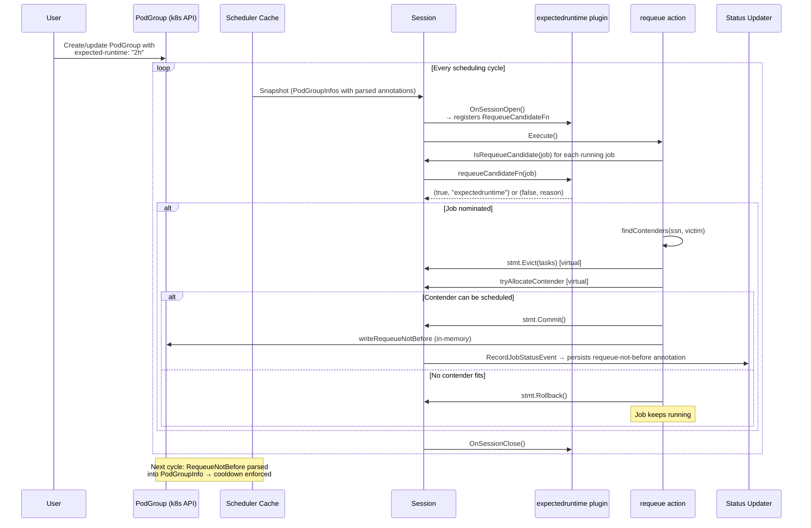

<!--
Copyright 2025 NVIDIA CORPORATION
SPDX-License-Identifier: Apache-2.0
-->

# Expected Runtime Plugin for Soft Eviction via Requeue Action

## Table of Contents

1. [Summary](#summary)
2. [Motivation](#motivation)
3. [Goals](#goals)
4. [Non-Goals](#non-goals)
5. [Background: Existing Patterns](#background-existing-patterns)
6. [Proposal](#proposal)
7. [Design Details](#design-details)
   - [Annotation API](#annotation-api)
   - [PodGroupInfo Extensions](#podgroupinfo-extensions)
   - [Plugin: `expectedruntime`](#plugin-expectedruntime)
   - [Action: `requeue`](#action-requeue)
   - [Session Extension Points](#session-extension-points)
   - [Status Updater Integration](#status-updater-integration)
   - [Metrics](#metrics)
8. [Component Interaction](#component-interaction)
9. [Concrete Examples](#concrete-examples)
10. [Test Plan](#test-plan)
11. [Backward Compatibility](#backward-compatibility)
12. [Risks and Mitigations](#risks-and-mitigations)
13. [Graduation Criteria](#graduation-criteria)
14. [Alternatives Considered](#alternatives-considered)
15. [Phasing](#phasing)
16. [Implementation History](#implementation-history)

---

## Summary

This design proposes the `expectedruntime` scheduler plugin and a companion `requeue` scheduling action. Together they implement **soft eviction eligibility**: a running job that has exceeded its user-declared expected runtime becomes a *candidate* for requeue, but is only actually evicted if doing so allows a higher-priority workload to be scheduled. If no contender benefits, the job continues running undisturbed.

---

## Motivation

### Problem Statement

KAI Scheduler currently has no mechanism to reclaim resources from long-running jobs in a *resource-aware* way. Existing approaches fall into two categories:

1. **Hard max-runtime controllers** (external): Kill the job unconditionally when time expires, even when no other workload needs the resources. This wastes partially-completed work and causes unnecessary churn.
2. **No runtime control at all**: Jobs can run indefinitely, starving higher-priority workloads in scenarios where time-based fairness should apply (e.g., a queue that has exceeded its fair share duration).

The expected runtime mechanism fills the gap: jobs *yield* resources at the right moment — when contention exists — rather than being killed on a hard timer.

### Use Cases

**Use case 1 — Time-based fairness enforcement**: A queue has consumed far beyond its fair-share time. Strict DRF would not reclaim because the queue's allocated resources are within quota. A job with `expected-runtime: 4h` that has been running for 5h becomes eligible for soft eviction if a higher-priority job in another queue is pending.

**Use case 2 — Resource efficiency with grace**: A research job has an expected runtime of 2h but has been running for 3h (perhaps it converged slowly). The scheduler will only evict it if doing so unblocks a waiting workload; otherwise the job finishes naturally.

**Use case 3 — Repeated batch workloads with cooldown**: A recurring training job should run every 4h. With `expected-runtime: 4h` and `requeue-delay: 15m`, the scheduler will requeue it if contention exists, but the cooldown prevents back-to-back eviction/reschedule thrash.

---

## Goals

1. Implement an opt-in `expectedruntime` plugin that nominates running jobs as requeue candidates when they exceed a configured runtime.
2. Implement a `requeue` scheduling action that performs transactional soft eviction: attempt to schedule a contender → commit if it succeeds, rollback if it fails (job keeps running).
3. The plugin is **side-effect free**: it only produces nominations, never evicts.
4. Support a configurable cooldown gate (`requeue-delay` / `requeue-not-before`) to prevent eviction thrash.
5. Respect the existing `minruntime` plugin's protection window when deciding requeue eligibility.
6. Provide Prometheus metrics for nominations, skips, and requeue commits.
7. Full backward compatibility: workloads without the opt-in annotation are completely unaffected.

---

## Non-Goals

1. **Hard max-runtime enforcement** (kill on deadline regardless of contention) — use an external controller for that.
2. **Performing eviction inside the plugin** — the `requeue` action owns that responsibility.
3. **New CRD spec fields in Phase 1** — annotations only; spec fields are Phase 3.
4. **Queue-level defaults in Phase 1** — per-workload opt-in only; queue defaults are Phase 2.
5. **Guaranteeing re-admission** — the plugin nominates; the allocate action handles re-scheduling the evicted job.
6. **Kubebuilder validation tags** — this design introduces no new CRD spec fields in Phase 1 (annotations only). Therefore no `+kubebuilder:validation:*` markers are required. CRD field promotion is deferred to Phase 3, at which point kubebuilder validation tags will be added with the spec field changes.

---

## Background: Existing Patterns

The design deliberately mirrors the `minruntime` plugin, which is the closest existing analogue. Key observations:

### `minruntime` plugin

- Registers `AddReclaimVictimFilterFn` and `AddPreemptVictimFilterFn` hooks on `OnSessionOpen`.
- Is **stateless with respect to eviction**: filters return a boolean, never mutate cluster state.
- Reads `LastStartTimestamp` from `PodGroupInfo` (parsed from the `kai.scheduler/last-start-timestamp` annotation, written by `default_status_updater.go`).
- Uses per-session caches (`preemptProtectionCache`, `reclaimProtectionCache`) to avoid recomputing the same filter result within a cycle.

### Statement / action pattern

All eviction actions (`reclaim`, `preempt`, `stalegangeviction`) use a `Statement` object for transactional operations:
- `stmt.Checkpoint()` → create rollback point
- `stmt.Evict(pod, msg)` → virtual eviction
- `stmt.Allocate(pod, node)` → virtual allocation
- `stmt.Commit()` / `stmt.Discard()` / `stmt.Rollback(checkpoint)` → finalize or undo

The `JobSolver` in `solvers/job_solver.go` encapsulates the try/commit/rollback pattern — the `requeue` action will follow the same model.

### Annotation constants

Existing annotation keys live in `pkg/common/constants/constants.go`. New keys follow the same pattern (`kai.scheduler/<key>`).

---

## Proposal

This proposal introduces two new components:

1. **`expectedruntime` plugin**: Registers a `RequeueCandidateFn` hook. For each running job, it checks six eligibility criteria (running status, preemptibility, annotation presence, start timestamp, time expiry, cooldown gate). It emits a nomination when all criteria pass. The plugin is purely declarative — it never mutates cluster state.

2. **`requeue` action**: Runs after `stalegangeviction` in the scheduling cycle. It collects all nominated jobs (from all registered `RequeueCandidateFn` implementations), then for each nominee attempts a transactional eviction+allocation pair using the existing `Statement` pattern. If the contender fits after virtual eviction of the victim, the action commits and writes the `requeue-not-before` cooldown annotation. Otherwise it rolls back and the victim continues running.

The key design decisions are:

- **Nomination/eviction separation**: The plugin nominates; the action evicts. This preserves the side-effect-free plugin contract and enables multiple plugins to collaboratively nominate jobs.
- **Transactional safety**: All evictions are simulated before committing, using the same `Statement` rollback mechanism as `reclaim` and `preempt`.
- **Cooldown via annotation**: The `requeue-not-before` annotation is written by the action after a successful commit and persisted by the existing status updater. This prevents thrash without requiring additional controller infrastructure.
- **Opt-in only**: No workload is affected unless it carries the `kai.scheduler/expected-runtime` annotation.

The three new annotation keys (`kai.scheduler/expected-runtime`, `kai.scheduler/requeue-delay`, `kai.scheduler/requeue-not-before`) follow the existing `kai.scheduler/` prefix convention established in `pkg/common/constants/constants.go`.

---

## Design Details

### Annotation API

Three new PodGroup annotation keys are introduced (all under the `kai.scheduler/` prefix):

```go
// pkg/common/constants/constants.go (additions)
const (
    // ExpectedRuntime is the duration after which a job becomes eligible for requeue nomination.
    // Format: Go duration string (e.g. "2h", "30m", "90m").
    // User-settable; opt-in.
    ExpectedRuntime = "kai.scheduler/expected-runtime"

    // RequeueDelay is the cooldown period after a committed requeue before the job can be
    // nominated again. Format: Go duration string. User-settable; opt-in.
    RequeueDelay = "kai.scheduler/requeue-delay"

    // RequeueNotBefore is an RFC3339 timestamp written by the requeue action upon a committed
    // eviction. Acts as the "not-before" gate for the next nomination cycle.
    // SYSTEM-MANAGED: users must not set this manually.
    RequeueNotBefore = "kai.scheduler/requeue-not-before"
)
```

#### Annotation semantics

| Annotation | Who sets it | Meaning |
|---|---|---|
| `kai.scheduler/expected-runtime` | User | After this duration from `LastStartTimestamp`, job is eligible for requeue nomination |
| `kai.scheduler/requeue-delay` | User | Cooldown after a committed requeue. If absent, no cooldown is enforced |
| `kai.scheduler/requeue-not-before` | System (requeue action) | Absolute timestamp; job cannot be nominated before this time. Written after each committed requeue as `now + requeue-delay` |

---

### PodGroupInfo Extensions

Two new fields are added to `PodGroupInfo` to carry the parsed annotation values, following the exact same pattern as `LastStartTimestamp`:

```go
// pkg/scheduler/api/podgroup_info/job_info.go (additions to PodGroupInfo struct)
type PodGroupInfo struct {
    // ... existing fields ...

    // ExpectedRuntime is the parsed value of the kai.scheduler/expected-runtime annotation.
    // nil means the annotation is absent or invalid (job is not eligible for expected-runtime nomination).
    ExpectedRuntime *time.Duration

    // RequeueNotBefore is the parsed value of the kai.scheduler/requeue-not-before annotation.
    // nil means no cooldown gate is active.
    RequeueNotBefore *time.Time
}
```

Parsing occurs in `SetPodGroup()`, mirroring how `LastStartTimestamp` is parsed today:

```go
// In PodGroupInfo.SetPodGroup() (additions)

if raw := pg.Annotations[commonconstants.ExpectedRuntime]; raw != "" {
    d, err := str2duration.ParseDuration(raw)
    if err != nil {
        log.InfraLogger.V(7).Warnf(
            "Failed to parse expected-runtime for podgroup <%s>: %v", pgi.NamespacedName, err)
    } else if d > 0 {
        pgi.ExpectedRuntime = &d
    }
}

if raw := pg.Annotations[commonconstants.RequeueNotBefore]; raw != "" {
    t, err := time.Parse(time.RFC3339, raw)
    if err != nil {
        log.InfraLogger.V(7).Warnf(
            "Failed to parse requeue-not-before for podgroup <%s>: %v", pgi.NamespacedName, err)
    } else {
        pgi.RequeueNotBefore = &t
    }
}
```

---

### Plugin: `expectedruntime`

#### File layout

```
pkg/scheduler/plugins/expectedruntime/
  expectedruntime.go
  expectedruntime_test.go
  expectedruntime_suite_test.go
```

#### Plugin struct

```go
// pkg/scheduler/plugins/expectedruntime/expectedruntime.go

package expectedruntime

import (
    "time"

    "github.com/NVIDIA/KAI-scheduler/pkg/scheduler/api/podgroup_info"
    "github.com/NVIDIA/KAI-scheduler/pkg/scheduler/framework"
    "github.com/NVIDIA/KAI-scheduler/pkg/scheduler/log"
)

const pluginName = "expectedruntime"

type expectedRuntimePlugin struct{}

func New(_ framework.PluginArguments) framework.Plugin {
    return &expectedRuntimePlugin{}
}

func (p *expectedRuntimePlugin) Name() string { return pluginName }

func (p *expectedRuntimePlugin) OnSessionOpen(ssn *framework.Session) {
    ssn.AddRequeueCandidateFn(p.requeueCandidateFn)
}

func (p *expectedRuntimePlugin) OnSessionClose(_ *framework.Session) {}
```

#### Nomination function

The `requeueCandidateFn` signature (see [Session Extension Points](#session-extension-points)) is:

```go
type RequeueCandidateFn func(job *podgroup_info.PodGroupInfo) (bool, string)
```

Returns `(true, reason)` if the job should be nominated; `(false, skipReason)` otherwise.

```go
func (p *expectedRuntimePlugin) requeueCandidateFn(
    job *podgroup_info.PodGroupInfo,
) (bool, string) {
    // 1. Running check: must have active allocated tasks
    if job.GetActiveAllocatedTasksCount() == 0 {
        recordSkip("not_running")
        return false, "not_running"
    }

    // 2. Preemptible check: only preemptible jobs are eligible (Phase 1)
    if !job.IsPreemptibleJob() {
        recordSkip("not_preemptible")
        return false, "not_preemptible"
    }

    // 3. Configuration check: expected-runtime annotation must be present and valid
    if job.ExpectedRuntime == nil {
        // Not opt-in — silent skip, no metric (avoids high cardinality noise)
        return false, ""
    }

    // 4. LastStartTimestamp must be set (written by status_updater on first allocation)
    if job.LastStartTimestamp == nil {
        recordSkip("missing_start_timestamp")
        return false, "missing_start_timestamp"
    }

    now := time.Now()

    // 5. Time check: has the job exceeded its expected runtime?
    elapsed := now.Sub(*job.LastStartTimestamp)
    if elapsed < *job.ExpectedRuntime {
        recordSkip("not_expired")
        return false, "not_expired"
    }

    // 6. Cooldown gate: if requeue-not-before is set, respect it
    if job.RequeueNotBefore != nil && now.Before(*job.RequeueNotBefore) {
        recordSkip("cooldown")
        return false, "cooldown"
    }

    // All checks passed — nominate
    recordNomination()
    log.InfraLogger.V(4).Infof(
        "Nominating job <%s/%s> for requeue: elapsed=%v, expected=%v",
        job.Namespace, job.Name, elapsed.Round(time.Second), *job.ExpectedRuntime)
    return true, pluginName
}
```

#### Registration

```go
// pkg/scheduler/plugins/factory.go (addition)
framework.RegisterPluginBuilder("expectedruntime", expectedruntime.New)
```

---

### Action: `requeue`

#### File layout

```
pkg/scheduler/actions/requeue/
  requeue.go
  requeue_test.go
```

#### Overview

The `requeue` action:
1. Collects all running jobs nominated by at least one `RequeueCandidateFn`.
2. For each nominated victim (ordered by priority ascending — lowest priority first), attempts to find a pending higher-priority job that can be scheduled if the victim is evicted.
3. Uses a `Statement` (transactional) to try the eviction+allocation pair.
4. On success → `Commit()` + write `requeue-not-before` annotation.
5. On failure → `Rollback()`, victim keeps running.

#### Execution flow

```go
// pkg/scheduler/actions/requeue/requeue.go

package requeue

import (
    "time"

    "github.com/NVIDIA/KAI-scheduler/pkg/scheduler/api/eviction_info"
    "github.com/NVIDIA/KAI-scheduler/pkg/scheduler/api/pod_status"
    "github.com/NVIDIA/KAI-scheduler/pkg/scheduler/api/podgroup_info"
    "github.com/NVIDIA/KAI-scheduler/pkg/scheduler/framework"
    "github.com/NVIDIA/KAI-scheduler/pkg/scheduler/log"
    commonconstants "github.com/NVIDIA/KAI-scheduler/pkg/common/constants"
    metav1 "k8s.io/apimachinery/pkg/apis/meta/v1"
)

type requeueAction struct{}

func New() *requeueAction { return &requeueAction{} }

func (a *requeueAction) Name() framework.ActionType { return framework.Requeue }

func (a *requeueAction) Execute(ssn *framework.Session) {
    log.InfraLogger.V(2).Infof("Enter Requeue ...")
    defer log.InfraLogger.V(2).Infof("Leaving Requeue ...")

    // Phase 1: collect nominees (deduplicated, reasons union)
    nominees := collectNominees(ssn)
    if len(nominees) == 0 {
        return
    }

    // Phase 2: for each nominee, try to find a contender that can schedule
    for _, victim := range nominees {
        a.attemptRequeue(ssn, victim)
    }
}

// collectNominees queries all registered RequeueCandidateFns and deduplicates results.
func collectNominees(ssn *framework.Session) []*requeueNominee {
    seen := map[common_info.PodGroupID]*requeueNominee{}
    for _, job := range ssn.ClusterInfo.PodGroupInfos {
        nominated, reasons := ssn.IsRequeueCandidate(job)
        if !nominated {
            continue
        }
        seen[job.UID] = &requeueNominee{job: job, nominatedBy: reasons}
    }
    // Sort by priority ascending (lowest priority victims first)
    nominees := sortByPriorityAscending(seen)
    return nominees
}

func (a *requeueAction) attemptRequeue(ssn *framework.Session, nominee *requeueNominee) {
    victim := nominee.job
    log.InfraLogger.V(3).Infof(
        "Attempting requeue for job <%s/%s> (nominated_by=%v)",
        victim.Namespace, victim.Name, nominee.nominatedBy)

    // Find pending jobs that could benefit from victim's resources
    contenders := findContenders(ssn, victim)
    if len(contenders) == 0 {
        log.InfraLogger.V(4).Infof(
            "No contenders for requeue of <%s/%s>, job keeps running",
            victim.Namespace, victim.Name)
        return
    }

    // Try each contender in priority order (highest first)
    for _, contender := range contenders {
        stmt := ssn.Statement()
        checkpoint := stmt.Checkpoint()

        // Virtual eviction of all victim's tasks
        evicted := evictJobTasks(ssn, stmt, victim)
        if !evicted {
            stmt.Rollback(checkpoint)
            continue
        }

        // Try to allocate the contender
        allocated := tryAllocateContender(ssn, stmt, contender)
        if !allocated {
            stmt.Rollback(checkpoint)
            continue
        }

        // SUCCESS: commit and write cooldown annotation
        if err := stmt.Commit(); err != nil {
            log.InfraLogger.Errorf("Failed to commit requeue statement: %v", err)
            return
        }

        writeRequeueNotBefore(ssn, victim)
        log.InfraLogger.V(2).Infof(
            "Requeued job <%s/%s> to unblock contender <%s/%s>",
            victim.Namespace, victim.Name, contender.Namespace, contender.Name)
        return
    }

    log.InfraLogger.V(4).Infof(
        "Requeue for <%s/%s>: no contender could be scheduled after virtual eviction",
        victim.Namespace, victim.Name)
}
```

#### `writeRequeueNotBefore`

```go
func writeRequeueNotBefore(ssn *framework.Session, victim *podgroup_info.PodGroupInfo) {
    pg := victim.PodGroup
    if pg == nil {
        return
    }
    // Determine cooldown from annotation, default 0 (immediate re-eligibility)
    delay := time.Duration(0)
    if raw := pg.Annotations[commonconstants.RequeueDelay]; raw != "" {
        if d, err := str2duration.ParseDuration(raw); err == nil && d > 0 {
            delay = d
        }
    }
    notBefore := time.Now().Add(delay).UTC().Format(time.RFC3339)
    if pg.Annotations == nil {
        pg.Annotations = map[string]string{}
    }
    pg.Annotations[commonconstants.RequeueNotBefore] = notBefore
    // The status updater will persist this on the next RecordJobStatusEvent call.
    // Mark the in-memory object dirty so the updater picks it up.
    victim.RequeueNotBefore = &[]time.Time{time.Now().Add(delay)}[0]
}
```

#### Action ordering

The `requeue` action runs **after** `stalegangeviction` to avoid competing with gang cleanup:

```
Allocate → Consolidate → Reclaim → Preempt → StaleGangEviction → Requeue
```

```go
// pkg/scheduler/actions/factory.go (updated)
framework.RegisterAction(requeue.New())
```

---

### Session Extension Points

Two new session hooks are required:

#### `AddRequeueCandidateFn`

```go
// pkg/scheduler/framework/session.go (new field)
RequeueCandidateFns []api.RequeueCandidateFn

// pkg/scheduler/api/types.go (new type)
// RequeueCandidateFn is called for each running job; returns (true, nominatorName)
// if the job should be nominated as a requeue candidate, (false, skipReason) otherwise.
type RequeueCandidateFn func(job *podgroup_info.PodGroupInfo) (bool, string)

// pkg/scheduler/framework/session_plugins.go (new method)
func (ssn *Session) AddRequeueCandidateFn(fn api.RequeueCandidateFn) {
    ssn.RequeueCandidateFns = append(ssn.RequeueCandidateFns, fn)
}

// IsRequeueCandidate returns (true, reasons) if any plugin nominates the job.
// reasons is the union of all nominator names for observability.
func (ssn *Session) IsRequeueCandidate(job *podgroup_info.PodGroupInfo) (bool, []string) {
    var reasons []string
    for _, fn := range ssn.RequeueCandidateFns {
        nominated, reason := fn(job)
        if nominated && reason != "" {
            reasons = append(reasons, reason)
        }
    }
    return len(reasons) > 0, reasons
}
```

Multiple plugins can register `RequeueCandidateFn` (e.g., `expectedruntime` + a future `proportionexceeded` plugin). The requeue action takes the **union**: a job is a candidate if *any* plugin nominates it, and `nominatedBy` records all nominators for debugging.

---

### Status Updater Integration

The `requeue-not-before` annotation must be persisted when the action writes it. This integrates with the existing `updatePodGroupAnnotations` path in `default_status_updater.go`:

```go
// pkg/scheduler/cache/status_updater/default_status_updater.go (addition)

func setPodGroupRequeueNotBefore(podGroup *enginev2alpha2.PodGroup, notBefore *time.Time) bool {
    if podGroup.Annotations == nil {
        podGroup.Annotations = make(map[string]string)
    }
    if notBefore == nil {
        if _, found := podGroup.Annotations[commonconstants.RequeueNotBefore]; !found {
            return false
        }
        delete(podGroup.Annotations, commonconstants.RequeueNotBefore)
        return true
    }
    curr := podGroup.Annotations[commonconstants.RequeueNotBefore]
    formatted := notBefore.UTC().Format(time.RFC3339)
    if curr == formatted {
        return false
    }
    podGroup.Annotations[commonconstants.RequeueNotBefore] = formatted
    return true
}
```

And `updatePodGroupAnnotations` calls `setPodGroupRequeueNotBefore` alongside the existing stale/start timestamp setters.

---

### Metrics

New Prometheus counters in `pkg/scheduler/metrics/metrics.go`:

```go
var (
    // requeueNominationsTotal counts successful nominations per plugin.
    // Labels: plugin (finite set: "expectedruntime", ...)
    requeueNominationsTotal *prometheus.CounterVec

    // requeueNominationSkippedTotal counts skipped nominations per reason per plugin.
    // Labels: plugin, reason (finite set per plugin)
    requeueNominationSkippedTotal *prometheus.CounterVec

    // requeueCommitsTotal counts committed requeues (actual evictions) per action.
    requeueCommitsTotal prometheus.Counter

    // requeueRollbacksTotal counts rollbacks (no contender found) per action.
    requeueRollbacksTotal prometheus.Counter
)
```

Label cardinality contract:
- `plugin`: finite set of plugin names (e.g., `"expectedruntime"`)
- `reason`: finite set per plugin — `"not_running"`, `"not_preemptible"`, `"missing_start_timestamp"`, `"not_expired"`, `"cooldown"`, `"invalid_annotation"`

No job names, namespaces, or timestamps appear in metric labels.

---

## Component Interaction



---

## Concrete Examples

### Example 1 — Basic opt-in (job evicted to unblock contender)

```yaml
# User-facing PodGroup with expected runtime
apiVersion: scheduling.x-k8s.io/v1alpha2
kind: PodGroup
metadata:
  name: training-job-a
  namespace: team-alpha
  annotations:
    kai.scheduler/expected-runtime: "2h"
    kai.scheduler/requeue-delay: "10m"
spec:
  queue: team-alpha-queue
  # preemptibility must be Preemptible for Phase 1
  preemptionPolicy: PreemptLowerPriority
```

**Expected behavior**:
- At t=0: job starts, `kai.scheduler/last-start-timestamp` is written by the status updater.
- At t=1h55m: plugin checks → `elapsed (1h55m) < expectedRuntime (2h)` → not nominated.
- At t=2h05m: plugin checks → `elapsed (2h05m) >= expectedRuntime (2h)` → nominated.
- Requeue action finds a pending higher-priority job → virtual evict `training-job-a` → virtual allocate contender → fits → **commit**.
- `kai.scheduler/requeue-not-before` is written as `now + 10m`.
- `training-job-a` is evicted (pods deleted), enters pending state, will be rescheduled by `allocate` action.
- At t=2h15m: cooldown expires; job is now eligible again if still running.

---

### Example 2 — No contender (job keeps running)

Same YAML as Example 1, but no higher-priority pending jobs exist at t=2h05m.

**Expected behavior**:
- Plugin nominates `training-job-a`.
- Requeue action calls `findContenders()` → returns empty list.
- Job keeps running. No eviction, no annotation written.
- Logged at V(4): `"No contenders for requeue of <team-alpha/training-job-a>, job keeps running"`.

---

### Example 3 — Cooldown gate (prevents thrash)

After Example 1's commit, `requeue-not-before` = `T+10m`.

**Expected behavior**:
- At `T+5m`: plugin checks → `now (T+5m) < RequeueNotBefore (T+10m)` → skip with reason `"cooldown"`.
- Metric `requeue_nomination_skipped_total{plugin="expectedruntime",reason="cooldown"}` increments.
- At `T+11m`: cooldown expired → nomination resumes if job is still running and elapsed ≥ expected-runtime.

---

### Example 4 — Missing `LastStartTimestamp` (graceful degradation)

```yaml
# PodGroup without last-start-timestamp (e.g., newly created, not yet allocated)
metadata:
  annotations:
    kai.scheduler/expected-runtime: "1h"
# last-start-timestamp NOT yet set
```

**Expected behavior**:
- Plugin checks → `LastStartTimestamp == nil` → skip with reason `"missing_start_timestamp"`.
- Metric increments.
- Once allocated, status updater writes `kai.scheduler/last-start-timestamp`.
- Next cycle: timestamp present, timer starts.

---

### Example 5 — Multiple plugins nominating the same job

A future `proportionexceeded` plugin also implements `RequeueCandidateFn`. Both `expectedruntime` and `proportionexceeded` nominate `training-job-a`.

**Expected behavior**:
- `ssn.IsRequeueCandidate(job)` returns `(true, ["expectedruntime", "proportionexceeded"])`.
- Requeue action logs `nominated_by="expectedruntime,proportionexceeded"`.
- Deduplication is automatic: job appears once in `nominees` slice.
- Eviction event (if committed) records the union of nominators.

---

## Test Plan

### Unit Tests — Plugin (`pkg/scheduler/plugins/expectedruntime/expectedruntime_test.go`)

| Test case | What is verified |
|---|---|
| `TestNomination_BeforeExpiry` | Job with `elapsed < expectedRuntime` → not nominated, `not_expired` skip |
| `TestNomination_AfterExpiry` | Job with `elapsed >= expectedRuntime` → nominated |
| `TestNomination_MissingAnnotation` | Job without `expected-runtime` annotation → silent skip (no metric) |
| `TestNomination_InvalidAnnotation` | Job with `expected-runtime: "not-a-duration"` → skip, `invalid_annotation` metric |
| `TestNomination_MissingStartTimestamp` | `LastStartTimestamp == nil` → `missing_start_timestamp` skip |
| `TestNomination_CooldownActive` | `RequeueNotBefore` in the future → `cooldown` skip |
| `TestNomination_CooldownExpired` | `RequeueNotBefore` in the past → nominated |
| `TestNomination_NonPreemptible` | Non-preemptible job → `not_preemptible` skip |
| `TestNomination_NotRunning` | Job with 0 active tasks → `not_running` skip |
| `TestNomination_NegativeDuration` | Negative `expected-runtime` → skip, `invalid_annotation` metric |

Target: >80% line coverage in the plugin package.

### Unit Tests — Action (`pkg/scheduler/actions/requeue/requeue_test.go`)

| Test case | What is verified |
|---|---|
| `TestRequeue_NoNominees` | No nominated jobs → action is a no-op |
| `TestRequeue_NoContenders` | Nominees exist but no pending higher-priority jobs → rollback, job keeps running |
| `TestRequeue_CommitSucceeds` | Nominee + fitting contender → commit, `requeue-not-before` written |
| `TestRequeue_CommitFailsAllocation` | Contender cannot fit even after eviction → rollback |
| `TestRequeue_MultipleNominees` | Two nominees → each attempted independently |
| `TestRequeue_DeduplicationAcrossPlugins` | Same job nominated by two plugins → appears once in nominees |
| `TestRequeue_CooldownWritten` | After commit, `RequeueNotBefore = now + requeue-delay` |
| `TestRequeue_CooldownWrittenNoDuration` | No `requeue-delay` annotation → `RequeueNotBefore = now` (no enforced delay) |

### Integration Tests

Integration tests follow the pattern established in `pkg/scheduler/actions/integration_tests/`:

| Scenario | Description |
|---|---|
| `TestExpectedRuntime_SoftEviction_WithContender` | Full cycle: job exceeds expected runtime, contender pending, requeue commits |
| `TestExpectedRuntime_SoftEviction_NoContender` | Job exceeds expected runtime, no pending contenders, job keeps running |
| `TestExpectedRuntime_Cooldown_PreventsRenomination` | After commit, cooldown blocks next nomination within cooldown window |
| `TestExpectedRuntime_MinRuntimeInteraction` | Job with `expected-runtime` also within `minruntime` window → minruntime protection wins, not nominated |
| `TestExpectedRuntime_MultiPlugin_UnionNomination` | expectedruntime + mock plugin both nominate; job evicted once |

Coverage target: >80% across plugin + action packages.

### End-to-End Tests

E2E tests (using envtest or a local cluster):
1. Deploy PodGroup with `expected-runtime: 30s`, observe nomination in logs after 30s.
2. Deploy a higher-priority pending PodGroup; observe requeue commit and `requeue-not-before` annotation written.
3. Verify the evicted job re-enters pending and is rescheduled by allocate action.
4. Verify cooldown annotation blocks re-eviction within window.

### Benchmark Tests

No new benchmarks are required for Phase 1. The nomination scan is O(N) with cheap per-job checks. If profiling reveals overhead at scale, a per-session cache (matching the `minruntime` plugin pattern) will be added in Phase 2.

---

## Backward Compatibility

- All new annotations are **opt-in**. Workloads without `kai.scheduler/expected-runtime` are completely unaffected.
- The `requeue` action is registered but only acts on nominated jobs; clusters with no opted-in workloads see zero overhead beyond the O(N) nomination scan per cycle.
- The new `RequeueNotBefore` field on `PodGroupInfo` defaults to `nil`, which is the "no gate" state — existing logic is unaffected.
- No existing annotation keys, CRD fields, or scheduler configuration parameters are modified.
- **Default to disabled**: the `requeue` action can optionally be excluded from the default action list in `actions/factory.go` until Phase 1 is declared stable; operators opt-in by adding `requeue` to their `schedulerConfiguration.actions` list.

---

## Risks and Mitigations

| Risk | Likelihood | Impact | Mitigation |
|---|---|---|---|
| Clock skew causes incorrect expiry decisions | Low | Low | Use monotonic-safe `time.Now()` and `time.Since()`; log when elapsed is within 1s of boundary |
| Race between annotation write and next cycle read | Low | Low | `RequeueNotBefore` written in-memory first; persisted asynchronously; worst case: one extra nomination attempt, rejected by cooldown on next cycle |
| High nomination scan cost at scale (O(N) per cycle) | Low | Low | Scan is O(N) with cheap per-job checks; per-session caches can be added if profiling reveals issues |
| Victim evicted but contender fails to allocate due to non-resource constraints | Medium | Medium | Full transactional rollback; only commit if allocation succeeds in simulation |
| Multiple requeue actions interleaving with reclaim | Low | Medium | Requeue runs after reclaim/preempt; committed evictions in reclaim reduce victim pool for requeue naturally |
| `requeue-not-before` not persisted before next scheduler cycle starts | Low | Low | In-memory `RequeueNotBefore` field is set immediately at commit time; annotation persistence happens asynchronously but is idempotent |

---

## Graduation Criteria

### Phase 1 — Alpha

- All unit tests pass with >80% coverage in plugin and action packages.
- All integration tests pass with no regression in existing action tests.
- No regression in existing scheduler benchmarks (< 20% degradation threshold).
- Manually validated with Examples 1–5 on a test cluster.
- `requeue` action opt-in (not in default action list).

### Phase 2 — Beta

- Queue-level defaults tested end-to-end.
- Feature used in at least one production-like environment.
- `requeue` action added to default action list.
- E2E test coverage meets >80% target.

### Phase 3 — GA

- Stable API: `expectedRuntime` and `requeueDelay` promoted to `PodGroup.spec` fields with annotation backward compatibility shim.
- Kubebuilder validation tags added for all new spec fields.
- All annotation keys finalized with no breaking changes from Phase 1/2.
- Full documentation published in `docs/plugins/expectedruntime.md`.
- Operational runbook published.
- E2E test coverage meets >80% target.

---

## Alternatives Considered

### Alternative 1: Implement eviction logic inside the plugin

**Rejected.** Mixing nomination and eviction in a single plugin violates the side-effect-free plugin contract established by `minruntime`, `proportion`, and others. It would make it impossible for multiple plugins to collaboratively nominate the same job and would break the transactional guarantee of the `Statement` pattern.

### Alternative 2: Reuse the existing `reclaim` action with a new filter

The `reclaim` action could be extended with an additional victim selection pass that considers expected-runtime-expired jobs. **Rejected** because reclaim's semantics are strictly cross-queue (reclaimer and victim are in different queues). Expected-runtime requeue should be able to evict jobs in the *same or different* queue, making it a distinct action.

### Alternative 3: Inline cooldown enforcement only in the plugin

The plugin could enforce the cooldown itself, with the action simply evicting any nominated job. **Rejected** because the cooldown (`requeue-not-before`) must be written by the action *after a successful commit*, not before. If the plugin enforces it, there is a race: the plugin cannot know whether a given nomination will result in a commit or rollback. The action-level write is the correct place.

### Alternative 4: Use a `SoftDeadline` or `SoftMaxRuntime` naming

The issue lists `softdeadline` and `softmaxruntime` as naming options. **`expectedruntime` is preferred** because:
- "Deadline" implies hard cutoff semantics; "expected" correctly signals that it is a hint, not a guarantee.
- "MaxRuntime" suggests an absolute cap; "expected" better communicates intent.
- `expectedruntime` is concise and self-documenting in scheduler logs and metrics.

---

## Phasing

### Phase 1 — Alpha (this design)

- Annotation-based opt-in only.
- `expectedruntime` plugin with all 6 eligibility checks.
- `requeue` action with transactional try/commit/rollback.
- `requeue-not-before` cooldown gate, written by action on commit.
- Prometheus metrics for nominations, skips, commits, rollbacks.
- `requeue` action **opt-in** in scheduler config (not in default action list).

### Phase 2 — Beta

- Queue-level defaults: administrators can set `expectedRuntime` and `requeueDelay` on a Queue CRD, reducing per-workload config burden.
- Per-workload annotation overrides queue defaults.
- `requeue` action added to default action list.

### Phase 3 — GA

- Promote `expectedRuntime` and `requeueDelay` to `PodGroup.spec` fields (with annotation backward compatibility shim).
- Annotations remain supported as overrides for compatibility.
- Add kubebuilder validation tags for all new spec fields.
- Finalize naming of annotation keys (remove TBDs).
- Full documentation in `docs/plugins/expectedruntime.md`.

---

## Implementation History

| Date | Description |
|---|---|
| 2026-03-05 | Initial design document created |
| 2026-03-05 | Design revised: added required sections (Proposal, Design Details, Test Plan, Graduation Criteria); added kubebuilder validation tags note to Non-Goals; fixed heading hierarchy; restructured Test Strategy into Test Plan with benchmark section |

---

*Designed by KAI Agent*
