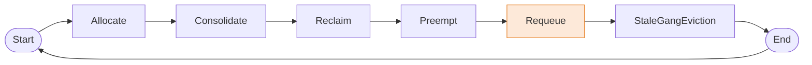
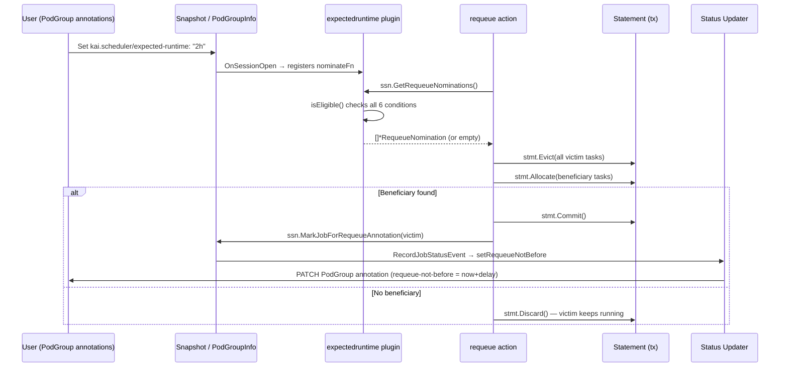
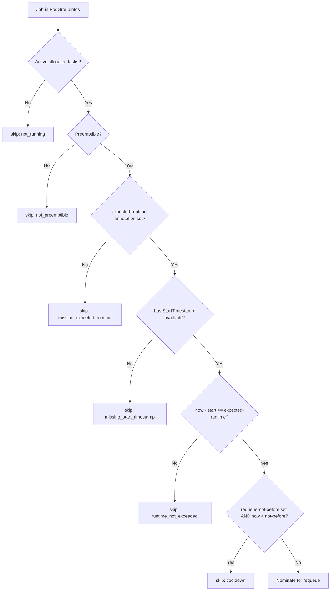

<!--
Copyright 2025 NVIDIA CORPORATION
SPDX-License-Identifier: Apache-2.0
-->

# Expected Runtime Plugin and Requeue Action

**Issue:** [#64](https://github.com/omer-dayan/KAI-Scheduler/issues/64)  
**Status:** Draft  
**Authors:** KAI Agent  
**Created:** 2026-03-05

---

## Table of Contents

1. [Summary](#summary)
2. [Motivation](#motivation)
3. [Goals and Non-Goals](#goals-and-non-goals)
4. [Background: Relevant Existing Patterns](#background-relevant-existing-patterns)
5. [Proposal](#proposal)
6. [Design Details](#design-details)
   - [Annotations (User Interface)](#annotations-user-interface)
   - [Constants](#constants)
   - [PodGroupInfo Integration](#podgroupinfo-integration)
   - [Session Plugin Hooks](#session-plugin-hooks)
   - [expectedruntime Plugin](#expectedruntime-plugin)
   - [Requeue Action](#requeue-action)
   - [Status Updater: Writing requeue-not-before](#status-updater-writing-requeue-not-before)
   - [Metrics](#metrics)
7. [Component Interaction Diagrams](#component-interaction-diagrams)
8. [Concrete Examples](#concrete-examples)
9. [Test Plan](#test-plan)
10. [Risks and Mitigations](#risks-and-mitigations)
11. [Graduation Criteria](#graduation-criteria)
12. [Alternatives Considered](#alternatives-considered)
13. [Implementation History](#implementation-history)

---

## Summary

This document proposes a new **`expectedruntime` plugin** and a companion **`requeue` action** for KAI-Scheduler. Together, they implement *soft eviction by expected runtime*: jobs that exceed a user-specified expected runtime become *candidates* for requeue, but are only *actually evicted* if doing so allows higher-priority or resource-starved workloads to run.

The design is explicitly **opt-in via PodGroup annotations** (Phase 1), with a clear path to queue-level defaults (Phase 2) and spec promotion (Phase 3).

---

## Motivation

Currently, KAI-Scheduler has no built-in mechanism for time-aware job turnover. Jobs that run beyond their expected duration continue consuming resources indefinitely, even when higher-priority workloads are waiting. Strict "max runtime" controllers exist but suffer from a critical flaw: they forcibly terminate jobs regardless of resource availability, wasting work that could have continued safely.

### Use Cases

1. **Time-fair fairness**: A queue has exhausted its time-based fair share, but no other queue is strong enough to reclaim from it under the current reclaim rules. An expected-runtime mechanism lets these over-run jobs become eligible for voluntary eviction once a contending workload arrives.

2. **Resource efficiency**: A long-running batch job exceeds its expected duration. Rather than hard-killing it, the scheduler yields its resources only when genuinely needed, allowing it to continue if capacity is idle.

3. **Predictable workload behavior**: ML training jobs, batch pipelines, and simulation workloads benefit from soft deadlines: "try to free resources after 4h, but only if someone actually needs them."

This feature is listed on the 2025 KAI-Scheduler roadmap as *"Support Max Run Time per workload (with delayed requeue)"*.

---

## Goals and Non-Goals

### Goals

- Introduce a new `expectedruntime` scheduler plugin that nominates running PodGroups as requeue candidates once they exceed a user-configured `expected-runtime` duration.
- Introduce a new `requeue` scheduler action that consumes requeue nominations and performs transactional virtual eviction (try → commit | rollback).
- Implement a cooldown gate (`requeue-not-before` annotation) to prevent thrashing after a committed requeue.
- Provide Prometheus metrics for nominations, skips, and committed requeues.
- Be fully opt-in: no change in behavior for workloads without the new annotations.
- Support multiple plugins nominating the same job (deduplication with reason union).

### Non-Goals

- Strict max-runtime enforcement (hard termination at a deadline — out of scope).
- Performing eviction inside the plugin itself (the action is solely responsible for that).
- Introducing new CRD spec fields in Phase 1 (annotations only). **Note on kubebuilder validation tags**: this design introduces no new CRD spec fields in Phase 1 (annotations only), so `+kubebuilder:validation:*` markers are not required. Spec field promotion is deferred to Phase 3, at which point appropriate validation markers will be added.
- Checkpoint/restore of running pod state (handled externally by checkpoint controllers, not the scheduler).
- Providing a queue-level default for `expected-runtime` in Phase 1 (Phase 2).

---

## Background: Relevant Existing Patterns

### `minruntime` plugin

The `minruntime` plugin (`pkg/scheduler/plugins/minruntime/`) is the closest analog. It:

- Reads `LastStartTimestamp` from `PodGroupInfo` (populated from the `kai.scheduler/last-start-timestamp` annotation).
- Registers `VictimFilterFn` hooks (`AddReclaimVictimFilterFn`, `AddPreemptVictimFilterFn`) and `ScenarioValidatorFn` hooks.
- Has a session-scoped protection cache to avoid recomputing decisions within a single scheduling cycle.
- Parses plugin arguments via `framework.PluginArguments.GetDuration(...)`.

The `expectedruntime` plugin follows this pattern almost exactly — but instead of *protecting* jobs from eviction, it *nominates* them.

### `reclaim` / `preempt` actions

Both actions follow a common pattern:
1. Build an ordered queue of candidate jobs.
2. For each candidate, build a `JobSolver` with a victim filter and scenario validator.
3. Call `solver.Solve(ssn, job)` to find a valid eviction scenario.
4. On success, call `statement.Commit()`.

The `requeue` action follows this same structure, but the *candidate queue* is the set of nominated jobs (from plugin hooks), and the *victim* of eviction is the nominated job itself (not the pending job's competitors).

### Annotation-based system-managed state

`kai.scheduler/last-start-timestamp` is written by `status_updater/default_status_updater.go` in `setPodGroupLastStartTimeStamp()`, called from `RecordJobStatusEvent()` → `updatePodGroupAnnotations()`. This exact pattern will be reused for `kai.scheduler/requeue-not-before`.

### `stalegangeviction` action

This action demonstrates a simpler eviction action structure: iterate over all jobs, check a condition, directly call `ssn.Evict()` without a solver. The `requeue` action is more complex (it needs to verify a pending job can schedule), but its structural skeleton is comparable.

---

## Proposal

This design proposes two tightly coupled components, implemented as a single deliverable:

| Component | Role | Location |
|---|---|---|
| `expectedruntime` plugin | Nominates over-runtime jobs as requeue candidates (side-effect free) | `pkg/scheduler/plugins/expectedruntime/` |
| `requeue` action | Consumes nominations; transactionally evicts only if a beneficiary can schedule | `pkg/scheduler/actions/requeue/` |

**Core mechanism:**

1. At session open, the `expectedruntime` plugin registers a `RequeueNominationFn` hook.
2. During the `requeue` action, `ssn.GetRequeueNominations()` collects nominations from all registered plugins (deduplicating by job UID, unioning reasons).
3. For each nominated job (sorted by longest overrun first), the action uses the `Statement` transactional machinery to virtually evict the job and attempt to allocate a pending beneficiary.
4. If a beneficiary is found: **commit** — the job is evicted and `kai.scheduler/requeue-not-before` is written to the PodGroup.
5. If no beneficiary is found: **rollback** — the job continues running with no annotation written.

This design is **fully backward compatible**: workloads without the `kai.scheduler/expected-runtime` annotation are not affected at all. The `requeue` action is not in the default action list and must be explicitly enabled.

The separation of plugin (nomination) from action (eviction) preserves the scheduler's core architectural invariant that plugins are side-effect-free and only actions make cluster mutations.

---

## Design Details

### Annotations (User Interface)

All annotation keys use the `kai.scheduler/` prefix (consistent with `kai.scheduler/last-start-timestamp` and `kai.scheduler/stale-podgroup-timestamp`):

| Annotation | Set by | Format | Meaning |
|---|---|---|---|
| `kai.scheduler/expected-runtime` | User | Duration string (`2h`, `30m`, `90s`) | After this elapsed wall-clock time (since `LastStartTimestamp`), the job becomes eligible for requeue nomination |
| `kai.scheduler/requeue-delay` | User | Duration string (`10m`) | Cooldown period after a committed requeue; written as `requeue-not-before = now + delay` by the action on commit |
| `kai.scheduler/requeue-not-before` | **System only** | RFC3339 timestamp | Gate: job will not be re-nominated until this time passes. Written by the `requeue` action on commit. |

> **Note:** `kai.scheduler/requeue-not-before` is system-managed. Users setting it manually is undefined behavior; the system will overwrite it on the next committed requeue.

### Constants

Constants are added to `pkg/common/constants/constants.go`:

```go
// Expected runtime / requeue annotations
ExpectedRuntime      = "kai.scheduler/expected-runtime"
RequeueDelay         = "kai.scheduler/requeue-delay"
RequeueNotBefore     = "kai.scheduler/requeue-not-before"
```

### PodGroupInfo Integration

`PodGroupInfo` (`pkg/scheduler/api/podgroup_info/job_info.go`) already carries `LastStartTimestamp *time.Time`. Two new fields are added (parsed from annotations in `SetPodGroup`, exactly as `LastStartTimestamp` is today):

```go
type PodGroupInfo struct {
    // ... existing fields ...

    // ExpectedRuntime is the user-specified expected duration for this job.
    // Parsed from kai.scheduler/expected-runtime annotation. Nil if not set.
    ExpectedRuntime *time.Duration

    // RequeueDelay is the cooldown period after a committed requeue.
    // Parsed from kai.scheduler/requeue-delay annotation. Nil means no cooldown.
    RequeueDelay *time.Duration

    // RequeueNotBefore is the system-managed gate: job is not re-eligible for
    // requeue nomination before this time. Nil means no gate is active.
    // Parsed from kai.scheduler/requeue-not-before annotation.
    RequeueNotBefore *time.Time
}
```

Parsing in `SetPodGroup`:

```go
// Parse expected-runtime
if raw, ok := pg.Annotations[commonconstants.ExpectedRuntime]; ok {
    if d, err := str2duration.ParseDuration(raw); err == nil && d > 0 {
        pgi.ExpectedRuntime = &d
    } else {
        log.InfraLogger.V(6).Warnf("Invalid expected-runtime annotation for podgroup <%s/%s>: %v",
            pg.Namespace, pg.Name, err)
    }
}

// Parse requeue-delay
if raw, ok := pg.Annotations[commonconstants.RequeueDelay]; ok {
    if d, err := str2duration.ParseDuration(raw); err == nil && d > 0 {
        pgi.RequeueDelay = &d
    }
}

// Parse requeue-not-before
if raw, ok := pg.Annotations[commonconstants.RequeueNotBefore]; ok {
    if t, err := time.Parse(time.RFC3339, raw); err == nil {
        pgi.RequeueNotBefore = &t
    }
}
```

### Session Plugin Hooks

A new plugin hook type is added to the framework. The `requeue` action needs to ask: *"which jobs are nominated for requeue?"*

In `pkg/scheduler/api/types.go`, add:

```go
// RequeueNominationFn is a function that returns requeue nominations for running jobs.
// Each nominated job is returned with one or more reasons (for observability/debugging).
// Plugins must not perform side effects — nominations are advisory only.
type RequeueNominationFn func(jobs map[common_info.PodGroupID]*podgroup_info.PodGroupInfo) []*RequeueNomination

// RequeueNomination pairs a job with the reason(s) it was nominated for requeue.
type RequeueNomination struct {
    Job     *podgroup_info.PodGroupInfo
    Reasons []string // e.g. ["expectedruntime", "proportion"]
}
```

In `pkg/scheduler/framework/session.go` (`Session` struct), add:

```go
RequeueNominationFns []api.RequeueNominationFn
```

In `pkg/scheduler/framework/session_plugins.go`, add:

```go
func (ssn *Session) AddRequeueNominationFn(fn api.RequeueNominationFn) {
    ssn.RequeueNominationFns = append(ssn.RequeueNominationFns, fn)
}

// GetRequeueNominations collects nominations from all registered plugins,
// deduplicates by job UID, and unions reasons.
func (ssn *Session) GetRequeueNominations() []*api.RequeueNomination {
    byUID := map[common_info.PodGroupID]*api.RequeueNomination{}
    for _, fn := range ssn.RequeueNominationFns {
        for _, nom := range fn(ssn.ClusterInfo.PodGroupInfos) {
            if existing, ok := byUID[nom.Job.UID]; ok {
                existing.Reasons = unionReasons(existing.Reasons, nom.Reasons)
            } else {
                byUID[nom.Job.UID] = nom
            }
        }
    }
    result := make([]*api.RequeueNomination, 0, len(byUID))
    for _, nom := range byUID {
        result = append(result, nom)
    }
    return result
}

func unionReasons(a, b []string) []string {
    seen := map[string]bool{}
    for _, r := range a { seen[r] = true }
    for _, r := range b {
        if !seen[r] { a = append(a, r); seen[r] = true }
    }
    return a
}
```

Also add the `Requeue` action type constant in `pkg/scheduler/framework/interface.go`:

```go
const (
    // ... existing constants ...
    Requeue ActionType = "requeue"
)
```

### expectedruntime Plugin

**Location:** `pkg/scheduler/plugins/expectedruntime/expectedruntime.go`

The plugin is **side-effect–free**: it only registers a `RequeueNominationFn`. It does not call `ssn.Evict()` or modify any Kubernetes objects.

```go
// Copyright 2025 NVIDIA CORPORATION
// SPDX-License-Identifier: Apache-2.0

package expectedruntime

import (
    "time"

    "github.com/NVIDIA/KAI-scheduler/pkg/scheduler/api"
    "github.com/NVIDIA/KAI-scheduler/pkg/scheduler/api/common_info"
    "github.com/NVIDIA/KAI-scheduler/pkg/scheduler/api/podgroup_info"
    "github.com/NVIDIA/KAI-scheduler/pkg/scheduler/framework"
    "github.com/NVIDIA/KAI-scheduler/pkg/scheduler/log"
    "github.com/NVIDIA/KAI-scheduler/pkg/scheduler/metrics"
)

const pluginName = "expectedruntime"

type expectedRuntimePlugin struct{}

func New(_ framework.PluginArguments) framework.Plugin {
    return &expectedRuntimePlugin{}
}

func (p *expectedRuntimePlugin) Name() string { return pluginName }

func (p *expectedRuntimePlugin) OnSessionOpen(ssn *framework.Session) {
    ssn.AddRequeueNominationFn(p.nominateFn)
}

func (p *expectedRuntimePlugin) OnSessionClose(_ *framework.Session) {}

func (p *expectedRuntimePlugin) nominateFn(
    jobs map[common_info.PodGroupID]*podgroup_info.PodGroupInfo,
) []*api.RequeueNomination {
    now := time.Now()
    var nominations []*api.RequeueNomination

    for _, job := range jobs {
        reason, eligible := p.isEligible(job, now)
        if eligible {
            log.InfraLogger.V(4).Infof(
                "expectedruntime: nominating job <%s/%s> for requeue (reason: %s)",
                job.Namespace, job.Name, reason)
            metrics.IncRequeueNominationsTotal(pluginName)
            nominations = append(nominations, &api.RequeueNomination{
                Job:     job,
                Reasons: []string{pluginName},
            })
        } else {
            metrics.IncRequeueNominationSkipped(reason)
        }
    }

    return nominations
}

// isEligible returns (skipReason, eligible).
// All checks must pass for a job to be nominated.
func (p *expectedRuntimePlugin) isEligible(
    job *podgroup_info.PodGroupInfo, now time.Time,
) (skipReason string, eligible bool) {
    // 1. Must have active allocated/running tasks
    if job.GetActiveAllocatedTasksCount() == 0 {
        return "not_running", false
    }

    // 2. Must be marked Preemptible (Phase 1: consistent with reclaim/preempt victim filters)
    if !job.IsPreemptibleJob() {
        return "not_preemptible", false
    }

    // 3. expected-runtime annotation must be present and valid
    if job.ExpectedRuntime == nil {
        return "missing_expected_runtime", false
    }

    // 4. LastStartTimestamp must be available
    if job.LastStartTimestamp == nil || job.LastStartTimestamp.IsZero() {
        return "missing_start_timestamp", false
    }

    // 5. Time check: elapsed >= expected-runtime
    elapsed := now.Sub(*job.LastStartTimestamp)
    if elapsed < *job.ExpectedRuntime {
        return "runtime_not_exceeded", false
    }

    // 6. Cooldown gate: if requeue-not-before is set, now must be >= not-before
    if job.RequeueNotBefore != nil && now.Before(*job.RequeueNotBefore) {
        return "cooldown", false
    }

    return "", true
}
```

**Registered in** `pkg/scheduler/plugins/factory.go`:

```go
framework.RegisterPluginBuilder("expectedruntime", expectedruntime.New)
```

### Requeue Action

**Location:** `pkg/scheduler/actions/requeue/requeue.go`

The `requeue` action:
1. Collects requeue nominations from `ssn.GetRequeueNominations()`.
2. For each nominated job (ordered by longest-over-expected-runtime first), attempts to find a pending job from any queue that *could* be scheduled if the nominated job were evicted.
3. Uses the existing `Statement` transactional machinery (Evict → try to allocate pending job → Commit | Rollback).
4. On **commit**: annotates the victim's PodGroup with `requeue-not-before = now + requeue-delay` (via `ssn.Cache.KubeClient()` or a dedicated hook in `RecordJobStatusEvent`).
5. On **rollback**: job keeps running. No annotation is written.

```go
// Copyright 2025 NVIDIA CORPORATION
// SPDX-License-Identifier: Apache-2.0

package requeue

import (
    "sort"
    "time"

    "github.com/NVIDIA/KAI-scheduler/pkg/scheduler/api"
    "github.com/NVIDIA/KAI-scheduler/pkg/scheduler/api/eviction_info"
    "github.com/NVIDIA/KAI-scheduler/pkg/scheduler/api/podgroup_info"
    "github.com/NVIDIA/KAI-scheduler/pkg/scheduler/framework"
    "github.com/NVIDIA/KAI-scheduler/pkg/scheduler/log"
    "github.com/NVIDIA/KAI-scheduler/pkg/scheduler/metrics"
)

type requeueAction struct{}

func New() *requeueAction { return &requeueAction{} }

func (a *requeueAction) Name() framework.ActionType { return framework.Requeue }

func (a *requeueAction) Execute(ssn *framework.Session) {
    log.InfraLogger.V(2).Infof("Enter Requeue ...")
    defer log.InfraLogger.V(2).Infof("Leaving Requeue ...")

    nominations := ssn.GetRequeueNominations()
    if len(nominations) == 0 {
        return
    }

    // Sort: longest over expected-runtime first (most urgent)
    sortNominationsByOverrun(nominations)

    for _, nom := range nominations {
        metrics.IncPodgroupsConsideredByAction()
        committed, beneficiary := a.attemptRequeue(ssn, nom)
        if committed {
            metrics.IncPodgroupScheduledByAction()
            log.InfraLogger.V(3).Infof(
                "Requeue committed: evicted <%s/%s> (reasons: %v), beneficiary: <%s/%s>",
                nom.Job.Namespace, nom.Job.Name, nom.Reasons,
                beneficiary.Namespace, beneficiary.Name)
            // Signal the status updater to write requeue-not-before
            ssn.MarkJobForRequeueAnnotation(nom.Job)
        } else {
            log.InfraLogger.V(4).Infof(
                "Requeue rolled back: no beneficiary found for <%s/%s>",
                nom.Job.Namespace, nom.Job.Name)
        }
    }
}

// attemptRequeue virtually evicts nom.Job, then tries to schedule any pending job.
// Returns (committed, beneficiary).
func (a *requeueAction) attemptRequeue(
    ssn *framework.Session,
    nom *api.RequeueNomination,
) (bool, *podgroup_info.PodGroupInfo) {
    stmt := ssn.Statement()

    // Virtually evict all running tasks of the nominated job
    evictionMetadata := eviction_info.EvictionMetadata{
        EvictionGangSize: nom.Job.GetActiveAllocatedTasksCount(),
        Action:           string(framework.Requeue),
        Preemptor:        nil,
    }
    for _, task := range nom.Job.GetAllPodsMap() {
        if err := stmt.Evict(task, "requeue: expected runtime exceeded", evictionMetadata); err != nil {
            stmt.Discard()
            return false, nil
        }
    }

    // Try to find a pending job that now fits
    beneficiary := a.findBeneficiary(ssn, stmt, nom.Job)
    if beneficiary == nil {
        stmt.Discard()
        return false, nil
    }

    if err := stmt.Commit(); err != nil {
        log.InfraLogger.Errorf("Failed to commit requeue statement for <%s/%s>: %v",
            nom.Job.Namespace, nom.Job.Name, err)
        return false, nil
    }
    return true, beneficiary
}

// findBeneficiary looks for any pending job (across all queues) that can schedule
// given the resources freed by evicting the nominated job.
func (a *requeueAction) findBeneficiary(
    ssn *framework.Session,
    stmt *framework.Statement,
    evictedJob *podgroup_info.PodGroupInfo,
) *podgroup_info.PodGroupInfo {
    // Iterate pending jobs in priority order (highest priority first)
    for _, job := range ssn.ClusterInfo.PodGroupInfos {
        if job.GetActiveAllocatedTasksCount() > 0 {
            continue // only consider pending jobs
        }
        if len(job.PodStatusIndex) == 0 || job.GetNumPendingTasks() == 0 {
            continue
        }
        cp := stmt.Checkpoint()
        if tryAllocatePendingJob(ssn, stmt, job) {
            return job
        }
        _ = stmt.Rollback(cp)
    }
    return nil
}

func tryAllocatePendingJob(
    ssn *framework.Session, stmt *framework.Statement, job *podgroup_info.PodGroupInfo,
) bool {
    // Simplified: attempt to allocate all pending tasks of the job
    // (a full implementation would use the existing FeasibleNodes + Solver machinery)
    for _, task := range job.GetPendingTasks() {
        placed := false
        for _, node := range ssn.ClusterInfo.Nodes {
            if ssn.FittingNode(task, node, false) {
                if err := stmt.Allocate(task, node.Name); err == nil {
                    placed = true
                    break
                }
            }
        }
        if !placed {
            return false
        }
    }
    return job.IsGangSatisfied()
}

func sortNominationsByOverrun(nominations []*api.RequeueNomination) {
    now := time.Now()
    sort.Slice(nominations, func(i, j int) bool {
        iOverrun := overrunDuration(nominations[i].Job, now)
        jOverrun := overrunDuration(nominations[j].Job, now)
        return iOverrun > jOverrun // longest overrun first
    })
}

func overrunDuration(job *podgroup_info.PodGroupInfo, now time.Time) time.Duration {
    if job.LastStartTimestamp == nil || job.ExpectedRuntime == nil {
        return 0
    }
    elapsed := now.Sub(*job.LastStartTimestamp)
    overrun := elapsed - *job.ExpectedRuntime
    if overrun < 0 {
        return 0
    }
    return overrun
}
```

**Registered in** `pkg/scheduler/actions/factory.go`:

```go
framework.RegisterAction(requeue.New())
```

### Status Updater: Writing `requeue-not-before`

To write `requeue-not-before` after a committed requeue, a session-level mechanism signals the status updater. The cleanest approach (matching the existing `StalenessInfo` / `LastStartTimestamp` pattern) is:

1. Add a `RequeueCommittedAt *time.Time` field to `PodGroupInfo`.
2. In `ssn.MarkJobForRequeueAnnotation(job)`, set `job.RequeueCommittedAt = ptr.To(time.Now())`.
3. In `status_updater/default_status_updater.go`, extend `updatePodGroupAnnotations` to check `RequeueCommittedAt`:

```go
func setRequeueNotBefore(podGroup *enginev2alpha2.PodGroup, committedAt *time.Time, delay *time.Duration) bool {
    if committedAt == nil {
        return false
    }
    if podGroup.Annotations == nil {
        podGroup.Annotations = make(map[string]string)
    }
    notBefore := *committedAt
    if delay != nil {
        notBefore = committedAt.Add(*delay)
    }
    newValue := notBefore.UTC().Format(time.RFC3339)
    if curr, found := podGroup.Annotations[commonconstants.RequeueNotBefore]; found && curr == newValue {
        return false
    }
    podGroup.Annotations[commonconstants.RequeueNotBefore] = newValue
    return true
}
```

This function is called inside `updatePodGroupAnnotations()`, and the resulting patch is pushed through the existing `pushToUpdateQueue` path — identical to how `LastStartTimestamp` is written today.

**Session hook** added to `session_plugins.go`:

```go
func (ssn *Session) MarkJobForRequeueAnnotation(job *podgroup_info.PodGroupInfo) {
    now := time.Now()
    job.RequeueCommittedAt = &now
}
```

### Metrics

New counters added to `pkg/scheduler/metrics/metrics.go`:

```go
var (
    requeueNominationsTotal   *prometheus.CounterVec  // {plugin}
    requeueNominationSkipped  *prometheus.CounterVec  // {reason}
    requeueCommittedTotal     prometheus.Counter
)
```

Metric names (with `kai` namespace prefix):

| Metric | Labels | Description |
|---|---|---|
| `kai_requeue_nominations_total` | `plugin` | Total requeue nominations produced by each plugin |
| `kai_requeue_nomination_skipped_total` | `reason` | Nominations skipped by reason (finite enum) |
| `kai_requeue_committed_total` | *(none)* | Total committed requeues |

**Skip reasons (finite enum):**
- `not_running`
- `not_preemptible`
- `missing_expected_runtime`
- `missing_start_timestamp`
- `runtime_not_exceeded`
- `cooldown`

---

## Component Interaction Diagrams

### Overall Scheduling Cycle (with Requeue)



> **Placement rationale:** Requeue runs after `Preempt` (all in-queue preemptions have been tried first) and before `StaleGangEviction` (which handles structural gang failures). This ordering ensures requeue is only used as a last resort for actively running jobs, not instead of normal scheduling.

### Plugin → Action Data Flow



### Eligibility Decision Tree



---

## Concrete Examples

### Example 1: Basic Happy Path — Job Exceeds Expected Runtime, Contender Exists

```yaml
apiVersion: scheduling.run.ai/v2alpha2    # long-running training job with expected-runtime annotation
kind: PodGroup
metadata:
  name: training-job-a
  namespace: team-ml
  annotations:
    kai.scheduler/expected-runtime: "4h"
    kai.scheduler/requeue-delay: "15m"
spec:
  queue: team-ml-queue
  minMember: 4
  priorityClassName: normal    # job is preemptible via queue config
```

**Timeline:**
1. `training-job-a` starts at T=0, occupying 4 GPUs.
2. At T=4h, `expectedruntime` plugin nominates it.
3. A new job `inference-job-b` (high-priority, pending) arrives at T=4h05m.
4. `requeue` action: virtually evicts `training-job-a` → `inference-job-b` fits → **commits**.
5. `kai.scheduler/requeue-not-before` is set to T=4h05m + 15m = T=4h20m on `training-job-a`.
6. `training-job-a` restarts from checkpoint (if checkpoint controller configured) or from scratch.

### Example 2: Rollback — Job Exceeds Expected Runtime, No Contender

```yaml
apiVersion: scheduling.run.ai/v2alpha2
kind: PodGroup
metadata:
  name: batch-job-c
  namespace: research
  annotations:
    kai.scheduler/expected-runtime: "2h"
    kai.scheduler/requeue-delay: "5m"
spec:
  queue: research-queue
  minMember: 2
```

**Timeline:**
1. `batch-job-c` starts at T=0.
2. At T=2h, `expectedruntime` plugin nominates it.
3. `requeue` action: virtually evicts `batch-job-c` — no pending job can fill the GPUs → **rollback**.
4. `batch-job-c` keeps running. No annotation written. Next cycle: same check, same result.

### Example 3: Cooldown Prevents Re-nomination

```yaml
metadata:
  annotations:
    kai.scheduler/expected-runtime: "1h"
    kai.scheduler/requeue-delay: "20m"
    kai.scheduler/requeue-not-before: "2025-06-01T14:20:00Z"    # system-written after first requeue commit
```

**Timeline:**
1. Job was evicted at T=14:00, `requeue-not-before` = 14:20.
2. Job restarts (picks up from checkpoint), starts again.
3. At T=15:00 (re-ran for 1h), plugin checks: `now (15:00) >= not-before (14:20)` → **passes cooldown**. If expected-runtime has elapsed again → re-nominated.
4. Between T=14:00 and T=14:20: plugin skips with `reason=cooldown`.

### Example 4: Multiple Plugins Nominating Same Job

Suppose a future `proportion` plugin also nominates a job that has been over-using its fair share. The `expectedruntime` plugin independently nominates the same job for time reasons.

```
Nominations returned:
  Plugin "expectedruntime": [{Job: job-x, Reasons: ["expectedruntime"]}]
  Plugin "proportion":      [{Job: job-x, Reasons: ["proportion"]}]

After GetRequeueNominations() deduplication:
  [{Job: job-x, Reasons: ["expectedruntime", "proportion"]}]
```

The `requeue` action logs: *"Requeue committed: evicted job-x (reasons: [expectedruntime, proportion])"*. The `nominated_by` field in log/event carries the full union.

### Example 5: Job Without Annotation — No Impact

```yaml
apiVersion: scheduling.run.ai/v2alpha2
kind: PodGroup
metadata:
  name: always-running-service
  namespace: platform
  annotations: {}    # no kai.scheduler/expected-runtime annotation set
spec:
  queue: platform-queue
```

The `expectedruntime` plugin skips this job at every cycle with `reason=missing_expected_runtime`. Zero impact on behavior.

---

## Test Plan

### Unit Tests: Plugin

**Location:** `pkg/scheduler/plugins/expectedruntime/expectedruntime_test.go`

| Test | Verifies |
|---|---|
| No annotation → skip | `missing_expected_runtime` reason |
| No LastStartTimestamp → skip | `missing_start_timestamp` reason |
| Not preemptible → skip | `not_preemptible` reason |
| No active tasks → skip | `not_running` reason |
| Runtime < expected → skip | `runtime_not_exceeded` reason |
| Runtime >= expected, no cooldown → nominate | Positive case |
| Cooldown active (now < not-before) → skip | `cooldown` reason |
| Cooldown elapsed (now >= not-before) → nominate | Cooldown expiry case |
| Invalid duration annotation → skip gracefully | Parsing robustness |
| Zero or negative duration → skip | Validation |

Target: **>85% statement coverage**.

### Unit Tests: Session Deduplication

**Location:** `pkg/scheduler/framework/session_plugins_test.go`

| Test | Verifies |
|---|---|
| Two plugins nominate same job → one entry, reasons unioned | Dedup logic |
| Two plugins nominate different jobs → two entries | No false dedup |
| Empty nominations → empty result | Edge case |

### Unit Tests: Action

**Location:** `pkg/scheduler/actions/requeue/requeue_test.go`

| Test | Verifies |
|---|---|
| No nominations → action is a no-op | Guard case |
| Nomination + no pending job fits → rollback, no annotation | Rollback path |
| Nomination + pending job fits → commit, annotation set | Commit path |
| Multiple nominations → longest overrun evicted first | Ordering |
| Statement evict fails → graceful degradation | Error handling |

### Integration Tests

**Location:** `pkg/scheduler/actions/integration_tests/requeue/requeue_test.go`

Following the exact pattern of `integration_tests/reclaim/reclaim_test.go` and using `integration_tests_utils`.

| Scenario | Verifies |
|---|---|
| Job exceeds expected-runtime, no contender → job keeps running | Rollback end-to-end |
| Job exceeds expected-runtime, high-pri pending job exists → evicted, pending scheduled | Commit end-to-end |
| Cooldown active → job not evicted until cooldown lapses | Cooldown gate |
| Two jobs nominated → both attempted in order; only one fits → only that one evicted | Multi-candidate |
| Plugin disabled (not in config) → zero nominations → requeue is no-op | Opt-in safety |
| Not-preemptible job → not evicted even after expected-runtime | Preemptibility filter |

Target: **>80% coverage** for both plugin and action packages.

### E2E Tests (Phase 2)

Full end-to-end tests using `envtest` or a live cluster fixture:
- Verify `kai.scheduler/requeue-not-before` is written to the PodGroup after commit.
- Verify cooldown annotation blocks re-eviction.
- Verify job remains running when no contender exists (across multiple scheduling cycles).

### Benchmark Regression Gate

No performance-sensitive hot paths are modified in Phase 1. The `nominateFn` is O(N) over PodGroups with cheap time comparisons — matching the `minruntime` plugin's complexity. A micro-benchmark is added to confirm no regression:

```bash
go test -bench=BenchmarkExpectedRuntimePlugin -benchmem \
  ./pkg/scheduler/plugins/expectedruntime/...
```

---

## Risks and Mitigations

| Risk | Impact | Mitigation |
|---|---|---|
| Requeue evicts a job but the freed resources are never used | Medium | Always virtual-evict first and verify a pending job can allocate before committing. Rollback if no beneficiary. |
| Clock skew between nodes and scheduler pod | Low | `LastStartTimestamp` and `requeue-not-before` use UTC RFC3339 as set by the scheduler pod clock. Small skew (seconds) is acceptable given expected-runtime is typically hours. |
| `requeue-not-before` annotation lost if PodGroup is deleted/re-created | Low | This is a fresh start; no cooldown applies. Acceptable by design. |
| Multiple scheduler instances writing `requeue-not-before` concurrently | Low | KAI-Scheduler runs as a single active instance (leader-election). Not an issue in standard deployment. |
| User manually sets `requeue-not-before` to a far future date | Low | This is a supported escape hatch (user can suppress requeue for a job). Documented as advisory. |
| Requeue of a large gang job takes a long time, blocking the action loop | Medium | Requeue action has a per-nomination timeout budget (can be added in Phase 2). Phase 1: gang jobs with large minMember are naturally harder to find a beneficiary for and will roll back quickly. |
| Performance: nominateFn called for all jobs every cycle | Low | O(N) scan with cheap time comparisons. Matches the `minruntime` plugin's complexity. Caching within a session is possible in Phase 2 if needed. |

---

## Graduation Criteria

### Phase 1 — Alpha (this design)

- All unit tests pass with coverage >85% (plugin) and >80% (action).
- All integration tests pass with no regressions in existing reclaim/preempt integration test suites.
- The `expectedruntime` plugin and `requeue` action are **opt-in only** (not in default plugin/action lists).
- Metrics are emitting correctly in a staging environment.
- Feature validated with at least one real-world workload scenario.

### Phase 2 — Beta

- Queue-level defaults for `expected-runtime` (new field on `QueueSpec`), so per-job annotation is not required for every workload.
- Smarter beneficiary search in `requeue` action (reuse `JobsSolver` machinery from preempt/reclaim).
- Plugin added to the default plugin list (but still requires explicit action registration).
- E2E tests passing.
- Graduation criteria: zero regressions in existing integration tests, used by at least 5 real-world workloads.

### Phase 3 — GA

- Promote `expected-runtime` and `requeue-delay` to first-class `PodGroup.Spec` fields with `+kubebuilder:validation:*` markers (with annotation fallback for backward compatibility).
- Action added to the default action list.
- Comprehensive E2E tests covering all graduation criteria from Phases 1 and 2.
- Stable annotation/spec API for 2 releases with no breaking changes.
- Documentation updated in `docs/plugins/` and `docs/actions/`.

---

## Alternatives Considered

### Alternative 1: Integrate into existing `reclaim` action

Add expected-runtime victim selection as a new victim source inside `reclaim.go`.

**Rejected**: The reclaim action is queue-fairness–driven (reclaimer must be in a different queue than victim). Expected-runtime requeue is orthogonal — the "trigger" is time, not inter-queue fairness. Mixing them would obscure semantics and make the code harder to reason about.

### Alternative 2: Evict directly in the plugin (no separate action)

The plugin itself calls `ssn.Evict()` when expected runtime is exceeded.

**Rejected**: This violates the scheduler's core design principle. Plugins are side-effect–free; only actions make cluster mutations. Direct eviction in a plugin also bypasses the transactional try/commit/rollback mechanism, risking resource fragmentation (evicting a job without confirming a pending job can take its resources).

### Alternative 3: A hard `maxruntime` annotation with a simple controller

Add a separate controller that watches PodGroups and deletes pods after a fixed time.

**Rejected**: This is a valid external use-case but does not solve the resource-efficiency problem. A hard kill at a wall-clock deadline wastes work when no one else needs the resources. The "soft eviction" semantic is a first-class KAI-Scheduler responsibility.

### Alternative 4: Reuse the `preempt` action for requeue

Configure a special `expectedruntime` victim filter that makes reclaim/preempt already consider these jobs as victims.

**Partially valid**: The `minruntime` plugin already guards against very early eviction. One could argue that expected-runtime nominees are simply "preemptible after N hours" instead of the usual priority-based preemptibility. However, this conflates the nomination condition (time-based) with the existing priority/queue-based preemption ordering. Keeping a separate action preserves clarity and allows independent scheduling of the requeue cycle.

---

## Implementation History

| Date | Description |
|---|---|
| 2026-03-05 | Initial design document created (KAI Agent, Issue #64) |
| 2026-03-05 | Design revised (Iteration 1): restructured to standard KAI design doc format; added required `Proposal`, `Design Details`, `Test Plan` sections; added `Graduation Criteria` and `Implementation History` sections; added kubebuilder validation tag note to Non-Goals; fixed heading hierarchy; updated Table of Contents |
| 2026-03-05 | Design revised (Iteration 2): fixed heading hierarchy validator warnings by converting standalone `#` YAML comment lines (misidentified as H1 headings by the validator) to inline comments; no semantic changes |

---

## Summary of Files Changed / Created

| File | Change |
|---|---|
| `pkg/common/constants/constants.go` | Add 3 annotation constants |
| `pkg/scheduler/api/types.go` | Add `RequeueNominationFn`, `RequeueNomination` types |
| `pkg/scheduler/api/podgroup_info/job_info.go` | Add `ExpectedRuntime`, `RequeueDelay`, `RequeueNotBefore`, `RequeueCommittedAt` fields; parse in `SetPodGroup` |
| `pkg/scheduler/framework/interface.go` | Add `Requeue ActionType` constant |
| `pkg/scheduler/framework/session.go` | Add `RequeueNominationFns []api.RequeueNominationFn` field |
| `pkg/scheduler/framework/session_plugins.go` | Add `AddRequeueNominationFn`, `GetRequeueNominations`, `MarkJobForRequeueAnnotation` |
| `pkg/scheduler/metrics/metrics.go` | Add requeue nomination/committed metrics |
| `pkg/scheduler/plugins/expectedruntime/expectedruntime.go` | **New** — plugin implementation |
| `pkg/scheduler/plugins/expectedruntime/expectedruntime_test.go` | **New** — unit tests |
| `pkg/scheduler/plugins/factory.go` | Register `expectedruntime` plugin builder |
| `pkg/scheduler/actions/requeue/requeue.go` | **New** — action implementation |
| `pkg/scheduler/actions/requeue/requeue_test.go` | **New** — unit tests |
| `pkg/scheduler/actions/factory.go` | Register `requeue` action |
| `pkg/scheduler/cache/status_updater/default_status_updater.go` | Add `setRequeueNotBefore` function; extend `updatePodGroupAnnotations` |
| `pkg/scheduler/actions/integration_tests/requeue/requeue_test.go` | **New** — integration tests |

---

*Designed by KAI Agent*
