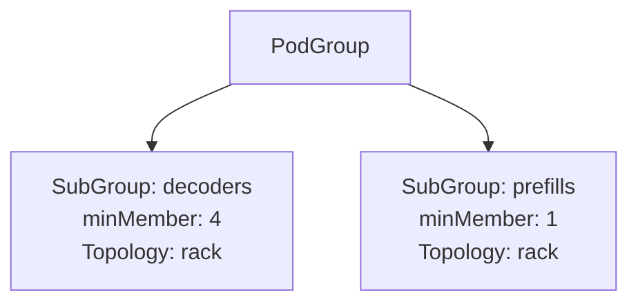
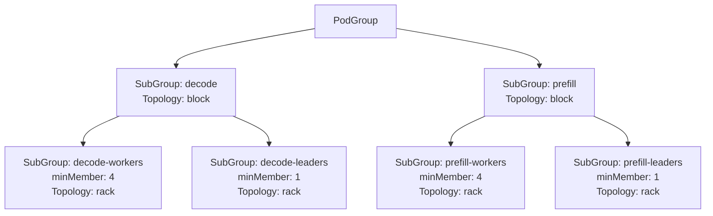

# Hierarchical PodGroup structure

## Overview
This document outlines an enhancement to the PodGroup architecture by introducing SubGroups within a PodGroup, enabling fine-grained control over gang scheduling and topology-aware placement for subsets of pods within a workload. While the PodGroup continues to enforce gang scheduling for the workload as a whole, this extension allows workloads to specify minMember and topology constraints on individual SubGroups, providing greater resolution over how smaller groups of pods are placed and scheduled. For example, a SubGroup can specify that only a subset of its pods must be scheduled together (minMember) and define specific network topology constraints aligned with that subset’s requirements. This design preserves atomic workload scheduling semantics while allowing advanced, granular placement policies that improve alignment with topology-aware scheduling strategies.

## Motivation
Modern inference workloads consist of components with varying network sensitivity and resource requirements, necessitating the ability to express fine-grained scheduling and placement preferences within the context of gang-scheduled workloads. Enforcing uniform constraints at the PodGroup level can lead to overly restrictive placement requirements that do not reflect the nuanced needs of different workload components. By introducing SubGroups within a PodGroup, workloads can specify per-SubGroup minMember requirements and topology constraints while maintaining overall gang scheduling semantics. This enables advanced placement strategies, improves scheduling flexibility and efficiency, and ensures that differentiated placement and partial gang constraints can be expressed without relaxing the workload’s atomic scheduling guarantees.

## Goals
- Fine-Grained Scheduling Specification: Allow PodGroups to define how smaller SubGroups of pods should be scheduled, specifying minMember and topology constraints per SubGroup.
- Preserve Atomicity with Flexibility: Maintain gang scheduling semantics at the workload level while enabling per-SubGroup constraints for granular control over subsets of pods.
- Advanced Topology-Aware Placement: Allow SubGroups within a PodGroup to define specific topology constraints for precise placement within the cluster.
- Improve Workload-Aligned Resource Utilization: Improve cluster utilization by supporting differentiated placement strategies without imposing overly restrictive uniform constraints.
- Backward Compatibility: Ensure existing workloads using PodGroups without SubGroups continue to function without modification.

## Non-Goals
- Partial Workload Execution: This design does not support executing subsets of pods independently before the PodGroup’s gang scheduling conditions are met.
- Topology Discovery and Optimization: The design does not include enhancements for topology discovery or automated topology optimization.
- Changes to Pod-Level Scheduling: This enhancement does not alter pod-level scheduling mechanisms beyond the SubGroup minMember and topology constraints applied within the PodGroup context.

## User Stories

### User Story 1: Fine-Grained Gang Scheduling
I want to specify a PodGroup requiring 10 pods to be scheduled atomically, while defining that the decode-workers SubGroup requires at least 4 pods to be scheduled as a gang, enabling better resource alignment for my workload’s architecture.

### User Story 2: SubGroup-Specific Topology Constraints
I want one SubGroup to be placed within the same rack for low latency, while allowing another SubGroup pods to be placed flexibly across the cluster, aligning network-sensitive components with workload requirements.

### User Story 3: Multi-SubGroup Workload with Co-Located Leaders and Workers
I want to define decode-leaders, decode-workers, prefill-leaders, and prefill-workers SubGroups where leaders and workers are co-located within each group, but prefill and decode groups may be scheduled in different locations to optimize resource placement.

### User Story 4: Backward Compatibility
I want my existing PodGroups without SubGroups to continue working without modification, ensuring a seamless migration path for advanced scheduling capabilities.

## Design Proposal
This proposal extends the PodGroup CRD and scheduling flow to introduce SubGroups within a PodGroup, enabling workloads to define fine-grained gang scheduling (minMember) and topology constraints for subsets of pods while preserving gang scheduling semantics at the workload level.

## Key Concepts
- PodGroup (unchanged): Represents a workload scheduled atomically as a gang (unchanged).
- SubGroup (new): A logical subset within a PodGroup, defined by:
    - name: Unique identifier within the PodGroup.
    - podSelector: Identifies pods in the SubGroup via labels.
    - minMember: Minimum number of pods in the SubGroup required for scheduling.
    - topologyConstraints: Placement requirements specific to the SubGroup (e.g., zone, rack).
- Scheduling Semantics:
    - The PodGroup is scheduled atomically (gang scheduling).
    - Each SubGroup may specify its own minMember and topology constraints.
    - SubGroups enable fine-grained placement specification but do not allow partial execution of the workload.

## API Changes
To support SubGroups within a PodGroup, the PodGroupSpec API is extended as follows:
```go
// PodGroupSpec defines the desired state of a PodGroup, representing a workload to be scheduled as a gang.
type PodGroupSpec struct {
	// Queue defines the queue to allocate resource for PodGroup; if queue does not exist,
	// the PodGroup will not be scheduled.
	Queue string `json:"queue,omitempty"`

	// If specified, indicates the PodGroup's priority. "system-node-critical" and
	// "system-cluster-critical" are two special keywords which indicate the
	// highest priorities with the former being the highest priority. Any other
	// name must be defined by creating a PriorityClass object with that name.
	// If not specified, the PodGroup priority will be default or zero if there is no
	// default.
	// +optional
	PriorityClassName string `json:"priorityClassName,omitempty"`

	// Should add "Unschedulable" event to the pods or not.
	MarkUnschedulable *bool `json:"markUnschedulable,omitempty"`

	// The number of scheduling cycles to try before marking the pod group as UnschedulableOnNodePool. Currently only supporting -1 and 1
	SchedulingBackoff *int32 `json:"schedulingBackoff,omitempty"`

	// TopologyConstraint defines the topology constraints for this PodGroup
	TopologyConstraint *TopologyConstraint `json:"topologyConstraint,omitempty"`

	// MinMember defines the minimal number of members/tasks to run the pod group;
	// if there's not enough resources to start all tasks, the scheduler will not start anyone.
	MinMember *int32 `json:"minMember,omitempty"`

	// SubGroups defines finer-grained subsets of pods within the PodGroup with individual scheduling constraints
	SubGroups []SubGroup `json:"subGroups,omitempty"`
}

type SubGroup struct {
    // Name uniquely identifies the SubGroup within the parent PodGroup.
	Name string `json:"name"`

	// Parent optionally specifies the name of a parent SubGroup, enabling hierarchical grouping.
	// +optional
	Parent string `json:"parent,omitempty"`

	// PodSelector identifies the pods belonging to this SubGroup by matching labels.
	PodSelector *metav1.LabelSelector `json:"podSelector,omitempty"`

	// TopologyConstraint defines the topology constraints for this SubGroup
	TopologyConstraint *TopologyConstraint `json:"topologyConstraint,omitempty"`

	// MinMember defines the minimal number of members/tasks to run this SubGroup;
	// if there's not enough resources to start all tasks, the scheduler will not start anyone.
	MinMember *int32 `json:"minMember,omitempty"`
}
```

### Validation
The following validations will be enforced via a Validating Webhook:
- Unique SubGroup name validation - ensure that all SubGroups within a PodGroup have unique names, preventing conflicts and enabling reliable hierarchical processing during scheduling.
- minMember validation - two validation approaches are under consideration:
   1. Leaf-Level Only: Restrict minMember to be set exclusively at the lowest (leaf) level of the PodGroup hierarchy, disallowing its specification at intermediate levels.
   2. Multi-Level Optional: Allow minMember to be optionally specified and enforced at any level within the PodGroup hierarchy, ensuring that each level can admit the minimum required number of pods necessary for gang scheduling at that level.
   Either approach can be enforced via a Validating Webhook to ensure consistency and prevent misconfiguration during CRD submission.
- SubGroup membership validation - the Validating Webhook can enforce that each pod associated with the workload is assigned to exactly one SubGroup, ensuring clear, non-overlapping SubGroup membership across all pods within the PodGroup.

## Examples

### Example 1: PodGroup with Two SubGroups
A PodGroup with two SubGroups (decode and prefill), each requiring rack-level placement with different minMember constraints.

```yaml
spec:
  subGroups:
    - name: decoders
      podSelector:
        matchLabels:
          role: decode
      minMember: 4
      topologyConstraints:
        requiredTopologyLevel: rack
    - name: prefills
      podSelector:
        matchLabels:
          role: prefill
      minMember: 1
      topologyConstraints:
        requiredTopologyLevel: rack
```

### Example 2: Multi-SubGroup Leaders and Workers
A PodGroup with four SubGroups (decode-leaders, decode-workers, prefill-leaders, prefill-workers), enforcing co-location within each group while allowing separation between decode and prefill groups.

```yaml
spec:
  subGroups:
    - name: decode
      topologyConstraints:
        requiredTopologyLevel: block
    - name: decode-workers
      parent: decode
      podSelector:
        matchLabels:
          role: decode-worker
      minMember: 4
      topologyConstraints:
        requiredTopologyLevel: rack
    - name: decode-leaders
      parent: decode
      podSelector:
        matchLabels:
          role: decode-leader
      minMember: 1
      topologyConstraints:
        requiredTopologyLevel: rack

    - name: prefill
      topologyConstraints:
        requiredTopologyLevel: block
    - name: prefill-workers
      parent: prefill
      podSelector:
        matchLabels:
          role: prefill-worker
      minMember: 4
      topologyConstraints:
        requiredTopologyLevel: rack
    - name: prefill-leaders
      parent: prefill
      podSelector:
        matchLabels:
          role: prefill-leader
      minMember: 1
      topologyConstraints:
        requiredTopologyLevel: rack
```

## Development
To ensure a controlled and backward-compatible rollout of PodGroup SubGroups with fine-grained scheduling, the following phased development plan is proposed:

### Phase 1: API Definition and Validation
- Extend the PodGroup [CRD](https://github.com/NVIDIA/KAI-Scheduler/blob/main/pkg/apis/scheduling/v2alpha2/podgroup_types.go) to support SubGroups with name, parent, podSelector, topologyConstraint, and minMember.
- (Optional) Implement optional validation to ensure:
    - Unique SubGroup names within a PodGroup.
    - Correct parent references and valid minMember values.
- Ensure full backward compatibility for workloads not utilizing SubGroups.

### Phase 2: Grove Plugin Integration
Update the PodGrouper Grove plugin to:
- Parse Grove CRDs defining hierarchical PodClique structures.
- Construct matching PodGroup CRDs with SubGroups, mapping PodCliques to SubGroups while preserving minMember and topology constraints.

### Phase 3: Scheduler Algorithm Adjustments
- Extend the scheduler to support multi-level PodGroup scheduling:
    - Enforce topologyConstraint and minMember at each PodGroup and SubGroup level.
    - Proceed hierarchically, ensuring constraints are met before advancing to deeper levels.
- Preserve gang scheduling semantics at the PodGroup level while enabling fine-grained SubGroup placement.
