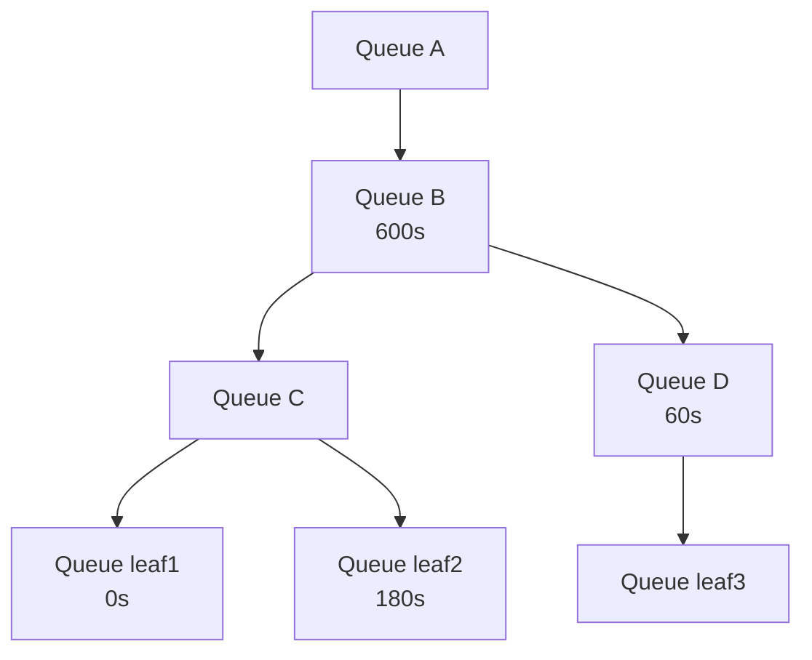
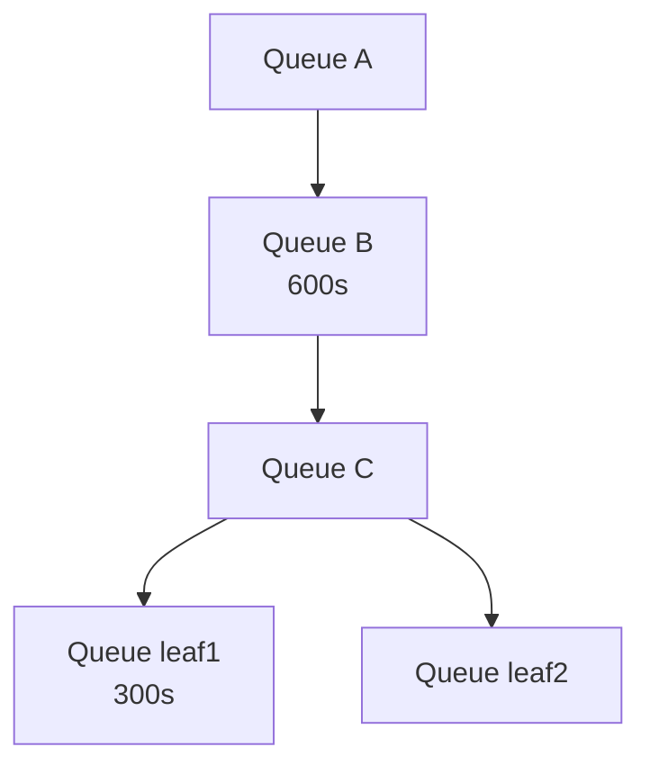

# [DRAFT] Minimum runtime before preemptions and reclaims

## Overview

This document proposes a new feature called "reclaim-min-runtime" and "preempt-min-runtime" that provides configurable guarantees for workload runtime before preemption or reclaim can occur. This feature enables administrators to define minimum runtime guarantees at various levels of the resource hierarchy: node pool, nth level queue and leaf-queue.

## Motivation

Unrestrained preemption can lead to resource thrashing, where workloads are repeatedly preempted before making meaningful progress. The min-runtime feature addresses this issue by providing configurable minimum runtime guarantees that can be set by either cluster operators or sometimes within parts of the queue to provide guarantees about minimal useful work.

## Detailed Design

### Reclaim Min Runtime Configuration

The reclaim-min-runtime parameter can be configured with the following values:

- **0 (default)**: Workloads are always preemptible via reclaims
- **-1**: Workloads are never preemptible via reclaims
- **Positive value**: Minimum guaranteed runtime before preemption via reclaims

### Preempt Min Runtime Configuration

In addition to protecting workloads from being preempted too early with reclaim-min-runtime, we also introduce preempt-min-runtime to ensure that in-queue preemptions are also protected with min-runtime.

The preempt-min-runtime parameter can be configured with the following values:

- **0 (default)**: Workloads can always be preempted by others (subject to reclaim-min-runtime constraints) in the same queue
- **-1**: Workloads can never be preempted by others in the same queue
- **Positive value**: Minimum guaranteed runtime before in-queue preemption

### Configuration Hierarchy

The configuration follows a hierarchical override structure:

1. **Node Pool Level**: Base configuration that applies to all reclaims/preemptions if not overridden by a queue. Default will be set to 0 which preserves existing behaviors to always reclaim/preempt.
2. **Queue Level**: Overrides node pool configuration for reclaims/preemptions, can be further overridden by a child queue. Default will be set to unassigned, causing the node pool level value to be used.

### Resolving the applicable min-runtime for reclaims and preemptions

#### Reclaims (preemptor and preemptee are in different queues)
1. Resolve the lowest common ancestor (LCA) between the leaf-queues of preemptor and preemptee.
2. Walk 1 step down to the child of the LCA that is an ancestor to the preemptee's leaf queue (or is the leaf queue).
3. Use the reclaim-min-runtime from this queue, if it is set. Otherwise move back up towards root of tree and select the first available queue-level override, or default to the node pool-level configuration value.

The idea around the algorithm here is to isolate settings of min-runtime in the queue tree to only affect siblings in reclaim scenarios, and for the potential to distribute the administration of these values in the queue tree (such as giving a user access to change parts of the tree). 
As a follow-up, we could also provide a setting to disable this and always use the leaf-tree resolved value in all cases. This could be favorable in a scenario where all min-runtimes in the queue tree are managed by one entity.

##### Example

1. A preemptor in leaf-queue `root.A.B.C.leaf1` and a preemptee in leaf-queue `root.A.B.D.leaf3` will use the min-runtime resolved for `root.A.B.D` (60s).

2. A preemptor in leaf-queue `root.A.B.C.leaf1` and a preemptee in leaf-queue `root.A.B.C.leaf2` will use the min-runtime resolved for `root.A.B.C.leaf2` (180s).

3. A preemptor in leaf-queue `root.A.B.D.leaf3` and a preemptee in leaf-queue `root.A.B.C.leaf1` will use the min-runtime resolved for `root.A.B.C` (600s inherited from ancestor `root.A.B`).

#### Preemptions (preemptor and preemptee are within the same leaf-queue)
Starting from the leaf-queue, walk the tree until the first defined preempt-min-runtime is set and use that.

##### Example

1. `root.A.B` has preempt-min-runtime: 600, `root.A.B.C.leaf1` has preempt-min-runtime: 300. Workloads in leaf1 will have preempt-min-runtime: 300.

2. `root.A.B` has preempt-min-runtime: 600, `root.A.B.C.leaf2` has preempt-min-runtime unset. Workloads in leaf2 will have preempt-min-runtime: 600.

## Development

### Phase 1

Add startTime to PodGroup by mimicking how staleTimestamp is set today:
https://github.com/NVIDIA/KAI-Scheduler/blob/420efcc17b770f30ca5b899bc3ca8969e352970a/pkg/scheduler/cache/status_updater/default_status_updater.go#L149-L154

This will be a readable annotation that is set to current time when the first pod of a podgroup reaches running state.

For scheduling purposes, the readable timestamp is converted to a unix timestamp when pods are snapshotted, using https://github.com/NVIDIA/KAI-Scheduler/blob/420efcc17b770f30ca5b899bc3ca8969e352970a/pkg/scheduler/api/podgroup_info/job_info.go#L81

### Phase 2

Prepare https://github.com/NVIDIA/KAI-Scheduler/blob/420efcc17b770f30ca5b899bc3ca8969e352970a/pkg/scheduler/framework/session_plugins.go to expose `IsPreemptible(preemptor, preemptee)` extension function (potentially moving existing isPreemptible to there?), as well as `IsReclaimable(preemptor, preemptee)`.
These functions will return `[]*common_info.PodID`, which is the set of PodIDs that are eligible for preemption/reclaims given the preemptor.

For the new Is* functions we will do set intersection between the results of each plugin returning the values, and use the result of that.

`IsReclaimable()`/`IsPreemptible()` will be called in each action's victim selection filters, and will be called only AFTER a workload has been considered eligible based on the fundamental filters of "reclaims" and "preemptible" (such as preemptible only being relevant for in-queue workloads). 
If the resulting set has length 0 the whole workload is considered not preemptible/reclaimable.

https://github.com/NVIDIA/KAI-Scheduler/blob/420efcc17b770f30ca5b899bc3ca8969e352970a/pkg/scheduler/actions/preempt/preempt.go#L105-L134

https://github.com/NVIDIA/KAI-Scheduler/blob/420efcc17b770f30ca5b899bc3ca8969e352970a/pkg/scheduler/actions/reclaim/reclaim.go#L154-L158

Additionally will rename existing `Reclaimable()` to `HasReclaimableResources()` to better reflect what it is doing (and its other variables/names for the same purpose). Also need to refactor PluginOptions potentially to reflect the changed name.
https://github.com/NVIDIA/KAI-Scheduler/blob/420efcc17b770f30ca5b899bc3ca8969e352970a/pkg/scheduler/framework/session_plugins.go#L88

### Phase 3

Implement configuration options for (preempt|reclaim)-min-runtime in node pool and queue configurations.

For node pool level, `pkg/scheduler/conf/scheduler_conf.go` seems like the appropriate place, in `SchedulerConfiguration`.
https://github.com/NVIDIA/KAI-Scheduler/blob/420efcc17b770f30ca5b899bc3ca8969e352970a/pkg/scheduler/conf/scheduler_conf.go#L18-L43

Since queues are defined as CRDs, the extra values will have to be implemented in `pkg/apis/scheduling/v2/queue_types.go` under `QueueSpec`.
https://github.com/NVIDIA/KAI-Scheduler/blob/420efcc17b770f30ca5b899bc3ca8969e352970a/pkg/apis/scheduling/v2/queue_types.go#L26-L49

If CRD allows it, we will use `time.Duration` to describe these values (also if `time.Duration` can describe -1 well), otherwise integer with seconds as value. 

### Phase 4

Implement min-runtime plugin for the scheduler that extends `IsReclaimable()` and `IsPreemptible()`, which will be used to filter out workloads eligible for preemption when scheduler tries to take these actions.

We will evaluate workloads in `InReclaimable()`/`IsPreemptible()` as follows:

 1. Resolve the correct min-runtime given scenario, preemptor and preemptee.
 2. If min-runtime is -1, return empty set.
 3. If currentTime > startTime + resolved min-runtime, return all pod ids in set.
 4. If workload does not have `MinAvailable` set, return empty set.
 5. Sort tasks in elasic workload based on reverse `TaskOrderFn` (to pick ones that can be sacrificed first), return (active-MinAvailable) pod ids in set.

`session_plugins.go` will take intersection of sets returned by `InReclaimable()`/`IsPreemptible()` and return it to reclaim/preempt action.

In either action, if length of set is non-zero, the information will be passed to the solver to consider the specific pods only when solving for a solution by getting the data down to https://github.com/NVIDIA/KAI-Scheduler/blob/420efcc17b770f30ca5b899bc3ca8969e352970a/pkg/scheduler/actions/common/solvers/pod_scenario_builder.go#L73 to filter out pods that can be evicted.