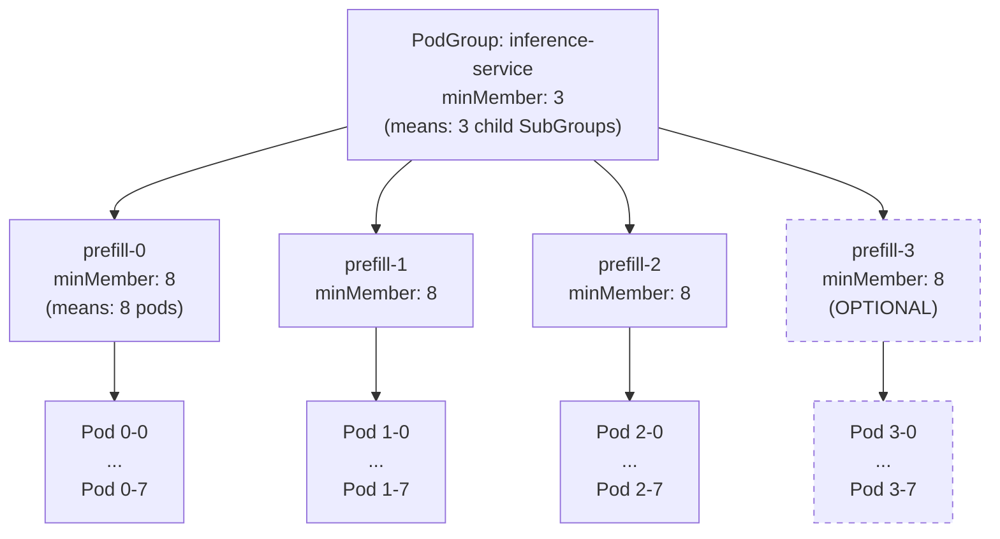
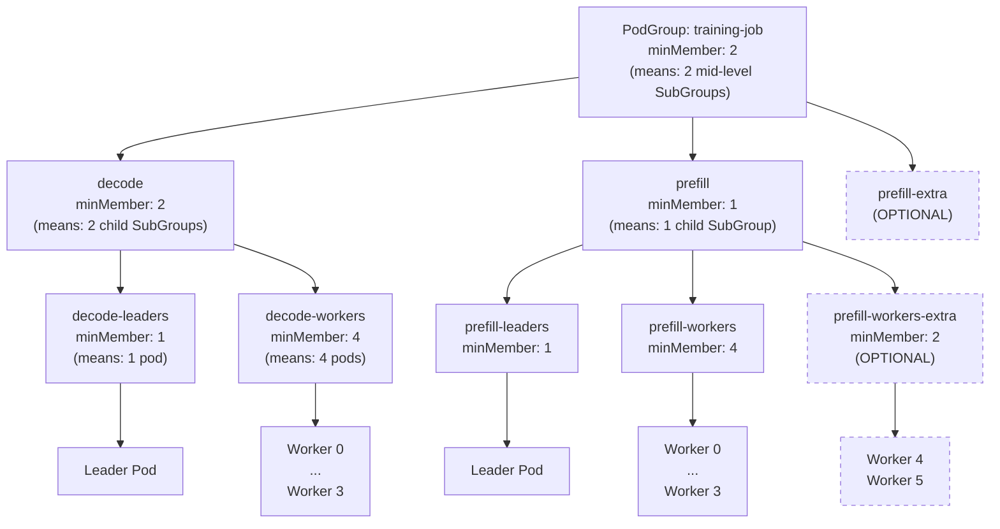
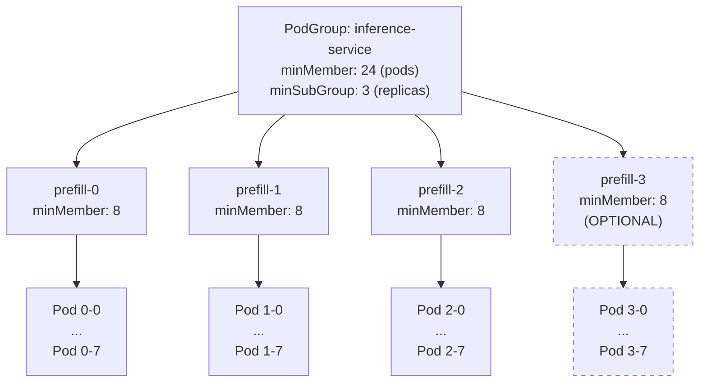
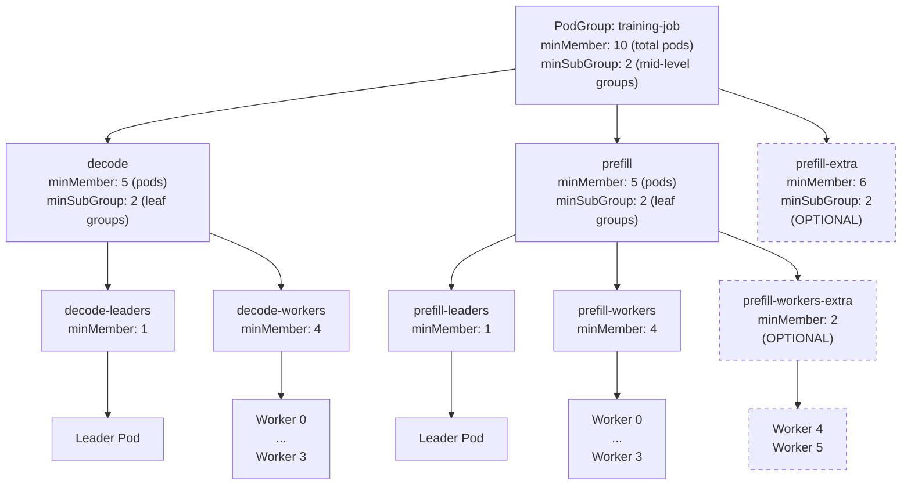

# Hierarchical Elastic Gang Scheduling via minSubGroup

## Overview

This design document explores improvements to the PodGroup minMember implementation to support **hierarchical elastic gang scheduling**. Currently, minMember only specifies the minimum number of *pods* required across all SubGroups, implicitly requiring all SubGroups to be ready. This design proposes mechanisms to specify the minimum number of *child SubGroups* (or replicas) that must be ready for a PodGroup or SubGroup to be considered schedulable, enabling elastic complex workloads where some replicas may fail while maintaining sufficient capacity.

## Motivation

### Current State

The `minMember` field in PodGroups and SubGroups refers exclusively to the count of descendant pods. This creates an implicit constraint: **all SubGroups must be ready** for the PodGroup to be scheduled. This works well for simple hierarchical structures but limits flexibility for elastic workloads.

**Example Problem (Dynamo/Grove):**
- A Grove workload has 4 prefill replicas (SubGroups), each requiring 8 pods (minMember=8)
- The top-level PodGroup has minMember=32 (4 replicas × 8 pods)
- If *one* prefill replica fails to schedule (e.g., only 6 pods available), the **entire workload fails**
- In practice, 3 prefill replicas might be sufficient to sustain the workload

### Desired State

Enable **per-level minimum replica/SubGroup thresholds** where:
1. Each PodGroup/SubGroup can specify the minimum number of *child SubGroups* required (not just total pods)
2. A PodGroup/SubGroup is ready when the specified minimum number of child SubGroups are themselves ready
3. This enables hierarchical elastic gang scheduling: some replicas can fail while the workload remains viable

### Use Cases

1. **Disaggregated Inference (Grove/Dynamo)**: 4 prefill replicas where 3 are sufficient
2. **Distributed Training**: 10 worker groups where 8 are required for convergence
3. **Leader-Worker Sets**: Multiple leader-worker pairs where a subset is viable
4. **Multi-Tier Services**: Service replicas where minimum availability ensures SLA compliance

## Important Design Consideration

> **[From Hagay's Note]:** Why do we need both `minMember` (pods) and `minSubGroup` (child SubGroups)?
>
> Could we simplify by having **one** `minMember` parameter that describes:
> - For **leaf SubGroups**: the minimum number of descendant pods
> - For **mid-level SubGroups** or **top PodGroups** with children: the minimum number of descendant *child SubGroups*

This document explores both approaches:
- **Option 1**: Reinterpret existing `minMember` based on SubGroup hierarchy level
- **Option 2**: Add explicit `minSubGroup` field alongside `minMember`

---

## Option 1: Single-Parameter Approach (Semantic minMember)

### Concept

Reuse the existing `minMember` field with context-dependent semantics:
- **Leaf SubGroups** (no children): `minMember` = minimum number of pods
- **Mid-level SubGroups** (has children): `minMember` = minimum number of *direct child SubGroups*
- **Top-level PodGroup** (has SubGroups): `minMember` = minimum number of *direct child SubGroups*

### API

No API changes required. Existing `PodGroupSpec` and `SubGroup` remain unchanged:

```go
type SubGroup struct {
    Name      string  `json:"name"`
    MinMember int32   `json:"minMember,omitempty"`
    Parent    *string `json:"parent,omitempty"`
    // ...
}
```

**Interpretation Rules:**
1. If a SubGroup has no children (leaf): `minMember` counts pods
2. If a SubGroup has children (mid-level): `minMember` counts direct child SubGroups
3. Top PodGroup with SubGroups: `minMember` counts direct child SubGroups

### Example: 2-Level Hierarchy (Disaggregated Inference)

```yaml
apiVersion: scheduling.run.ai/v2alpha2
kind: PodGroup
metadata:
  name: inference-service
spec:
  minMember: 3  # Need 3 out of 4 replicas (SubGroups)
  subGroups:
    - name: prefill-0
      minMember: 8  # Each replica needs 8 pods (leaf SubGroup)
    - name: prefill-1
      minMember: 8
    - name: prefill-2
      minMember: 8
    - name: prefill-3
      minMember: 8  # Optional - not required by top minMember
```

**Diagram: Single-Level Tree**



**Diagram: 2-Level Tree (Leader-Worker Groups)**



### Pros

1. ✅ **API Simplicity**: No new fields, backward compatible
2. ✅ **Conceptual Elegance**: Single parameter with clear interpretation based on context
3. ✅ **Minimal Code Changes**: Scheduling logic adjusts interpretation based on SubGroup hierarchy
4. ✅ **Zero Migration Cost**: Existing PodGroups continue working unchanged

### Cons

1. ❌ **Implicit Semantics**: Meaning changes based on SubGroup structure (less explicit)
2. ❌ **Learning Curve**: Users must understand context-dependent interpretation
3. ❌ **Validation Complexity**: Hard to validate minMember correctness without full tree structure
4. ❌ **Loss of Pod-Count Information**: For mid-level SubGroups, we lose the total pod count visibility
5. ❌ **Mixed Concerns**: Cannot specify *both* minimum SubGroups *and* total pod requirement at the same level
6. ❌ **Ambiguity**: What if a mid-level SubGroup wants to express "need 5 pods across any child SubGroups"?

---

## Option 2: Dual-Parameter Approach (Explicit minSubGroup)

### Concept

Introduce a new `minSubGroup` field alongside existing `minMember`:
- `minMember`: Always means minimum number of *descendant pods* (across all levels)
- `minSubGroup`: Minimum number of *direct child SubGroups* required

### API Changes

```go
type PodGroupSpec struct {
    // MinMember defines the minimal number of descendant pods required
    MinMember int32 `json:"minMember,omitempty"`

    // MinSubGroup defines the minimal number of direct child SubGroups required
    // Only applicable when SubGroups are defined
    // +optional
    MinSubGroup *int32 `json:"minSubGroup,omitempty"`

    SubGroups []SubGroup `json:"subGroups,omitempty"`
    // ...
}

type SubGroup struct {
    Name      string  `json:"name"`

    // MinMember defines the minimal number of descendant pods for this SubGroup
    MinMember int32   `json:"minMember,omitempty"`

    // MinSubGroup defines the minimal number of direct child SubGroups required
    // Only applicable when this SubGroup has child SubGroups
    // +optional
    MinSubGroup *int32  `json:"minSubGroup,omitempty"`

    Parent    *string `json:"parent,omitempty"`
    // ...
}
```

### Example: 2-Level Hierarchy (Disaggregated Inference)

```yaml
apiVersion: scheduling.run.ai/v2alpha2
kind: PodGroup
metadata:
  name: inference-service
spec:
  minMember: 24      # Total pods needed (3 replicas × 8 pods)
  minSubGroup: 3     # Need 3 out of 4 replicas
  subGroups:
    - name: prefill-0
      minMember: 8
    - name: prefill-1
      minMember: 8
    - name: prefill-2
      minMember: 8
    - name: prefill-3
      minMember: 8
```

**Diagram: Single-Level Tree**



**Diagram: 2-Level Tree (Leader-Worker Groups)**



### Pros

1. ✅ **Explicit Semantics**: Clear distinction between pod count and SubGroup count
2. ✅ **Flexible**: Can specify both minimum pods *and* minimum SubGroups independently
3. ✅ **Easy Validation**: Simple to validate consistency (minMember vs minSubGroup × child minMember)
4. ✅ **Better Observability**: Status can report both metrics clearly
5. ✅ **No Ambiguity**: Users know exactly what each field means
6. ✅ **Backward Compatible**: `minSubGroup` is optional; existing PodGroups work unchanged

### Cons

1. ❌ **API Complexity**: Adds new field to learn
2. ❌ **Potential Confusion**: Users might set contradictory values (e.g., minMember=10, minSubGroup=5 but each child needs 4 pods)
3. ❌ **Redundancy**: In many cases, `minMember` can be inferred from `minSubGroup` and child `minMember` values
4. ❌ **More Code**: Validation, status updates, and scheduling logic must handle both parameters

---

## Comparison Matrix

| Aspect | Option 1 (Semantic minMember) | Option 2 (Explicit minSubGroup) |
|--------|-------------------------------|----------------------------------|
| **API Simplicity** | ✅ No new fields | ❌ New field to learn |
| **Semantic Clarity** | ❌ Context-dependent | ✅ Always explicit |
| **Backward Compatibility** | ✅ Perfect | ✅ Perfect (optional field) |
| **Validation Complexity** | ❌ High | ✅ Straightforward |
| **Flexibility** | ❌ Cannot express both pod count and SubGroup count | ✅ Can express both independently |
| **User Confusion Risk** | ⚠️ Medium (must understand context) | ⚠️ Low-Medium (two parameters to coordinate) |
| **Implementation Complexity** | ⚠️ Medium (context-aware logic) | ⚠️ Medium (dual-parameter logic) |
| **Observability** | ❌ Harder to show both metrics | ✅ Easy to report both |

---

## Detailed Workload Examples

### 1. LeaderWorkerSet (LWS)

**Scenario**: 4 leader-worker groups, each with 1 leader + 5 workers. Need at least 3 groups ready.

#### Option 1 (Semantic minMember)

```yaml
apiVersion: scheduling.run.ai/v2alpha2
kind: PodGroup
metadata:
  name: lws-training
spec:
  minMember: 3  # 3 out of 4 groups
  subGroups:
    - name: group-0
      minMember: 2  # Leader + workers SubGroups needed
    - name: group-0-leader
      parent: group-0
      minMember: 1  # 1 leader pod
    - name: group-0-workers
      parent: group-0
      minMember: 5  # 5 worker pods

    - name: group-1
      minMember: 2
    - name: group-1-leader
      parent: group-1
      minMember: 1
    - name: group-1-workers
      parent: group-1
      minMember: 5

    # ... groups 2 and 3 similar
```

**Interpretation**:
- Top `minMember: 3` → need 3 child SubGroups (group-0, group-1, group-2 out of 4)
- Group `minMember: 2` → need 2 child SubGroups (leader + workers)
- Leaf `minMember: 1/5` → need pods

#### Option 2 (Explicit minSubGroup)

```yaml
apiVersion: scheduling.run.ai/v2alpha2
kind: PodGroup
metadata:
  name: lws-training
spec:
  minMember: 18     # Total pods (3 groups × 6 pods)
  minSubGroup: 3    # 3 out of 4 groups
  subGroups:
    - name: group-0
      minMember: 6    # 1 leader + 5 workers
      minSubGroup: 2  # Need both leader and workers SubGroups
    - name: group-0-leader
      parent: group-0
      minMember: 1
    - name: group-0-workers
      parent: group-0
      minMember: 5

    # ... groups 1, 2, 3 similar
```

---

### 2. Grove (Disaggregated Inference)

**Scenario**: 4 prefill replicas, 2 decode replicas. Need 3 prefills + 1 decode.

#### Option 1 (Semantic minMember)

```yaml
apiVersion: scheduling.run.ai/v2alpha2
kind: PodGroup
metadata:
  name: inference-grove
spec:
  minMember: 2  # Need 2 component types: prefill + decode
  subGroups:
    - name: prefill
      minMember: 3  # 3 out of 4 replicas
    - name: prefill-0
      parent: prefill
      minMember: 8  # Each replica needs 8 pods
    - name: prefill-1
      parent: prefill
      minMember: 8
    - name: prefill-2
      parent: prefill
      minMember: 8
    - name: prefill-3
      parent: prefill
      minMember: 8

    - name: decode
      minMember: 1  # 1 out of 2 replicas
    - name: decode-0
      parent: decode
      minMember: 4
    - name: decode-1
      parent: decode
      minMember: 4
```

#### Option 2 (Explicit minSubGroup)

```yaml
apiVersion: scheduling.run.ai/v2alpha2
kind: PodGroup
metadata:
  name: inference-grove
spec:
  minMember: 28     # 3×8 + 1×4 = 28 pods
  minSubGroup: 2    # Need prefill + decode
  subGroups:
    - name: prefill
      minMember: 24   # 3 replicas × 8 pods
      minSubGroup: 3  # 3 out of 4 replicas
    - name: prefill-0
      parent: prefill
      minMember: 8
    # ... prefill-1, 2, 3

    - name: decode
      minMember: 4    # 1 replica × 4 pods
      minSubGroup: 1  # 1 out of 2 replicas
    - name: decode-0
      parent: decode
      minMember: 4
    - name: decode-1
      parent: decode
      minMember: 4
```

---

### 3. Disaggregated Inference (Generic)

**Scenario**: Prefill (3 pods each, 2 replicas) + Decode (4 pods each, 1 replica).

#### Option 1

```yaml
spec:
  minMember: 2  # prefill + decode components
  subGroups:
    - name: prefill
      minMember: 2  # Both replicas needed
    - name: prefill-0
      parent: prefill
      minMember: 3  # 3 pods
    - name: prefill-1
      parent: prefill
      minMember: 3

    - name: decode
      minMember: 1  # 1 replica
    - name: decode-0
      parent: decode
      minMember: 4
```

#### Option 2

```yaml
spec:
  minMember: 10     # 2×3 + 1×4
  minSubGroup: 2    # prefill + decode
  subGroups:
    - name: prefill
      minMember: 6
      minSubGroup: 2
    - name: prefill-0
      parent: prefill
      minMember: 3
    - name: prefill-1
      parent: prefill
      minMember: 3

    - name: decode
      minMember: 4
      minSubGroup: 1
    - name: decode-0
      parent: decode
      minMember: 4
```

---

### 4. Leader + Workers Job (Non-LWS)

**Scenario**: 1 leader group + 3 worker groups, need leader + 2 workers.

#### Option 1

```yaml
spec:
  minMember: 3  # leader + 2 worker groups
  subGroups:
    - name: leader
      minMember: 1  # 1 pod
    - name: workers-0
      minMember: 4  # 4 pods
    - name: workers-1
      minMember: 4
    - name: workers-2
      minMember: 4  # Optional
```

#### Option 2

```yaml
spec:
  minMember: 9      # 1 leader + 2×4 workers
  minSubGroup: 3    # leader + 2 worker groups
  subGroups:
    - name: leader
      minMember: 1
    - name: workers-0
      minMember: 4
    - name: workers-1
      minMember: 4
    - name: workers-2
      minMember: 4
```

---

## Semi-Preemptible Considerations

### Context

Semi-preemptible mode (introduced in v0.10) allows workloads to be:
- **Non-preemptible** up to `minMember` pods
- **Preemptible** for any pods beyond `minMember`

### Question from Requirements

> "How does the podgroup controller know how to count the amount of non-preemptible resources for semi-preemptible workloads?"

### Option 1 (Semantic minMember)

- **Challenge**: If mid-level SubGroup's `minMember` counts child SubGroups (not pods), how do we determine pod count for non-preemptible quota?
- **Solution**: Traverse the tree to calculate total pods covered by minimum required SubGroups:
  ```
  NonPreemptiblePods = SumOf(minMember of leaf SubGroups under required path)
  ```
- **Example**: If top `minSubGroup=3` and each required SubGroup has `minMember=8` pods, then `NonPreemptiblePods = 3 × 8 = 24`

**Status Calculation (Pseudo-code)**:
```go
func CalculateNonPreemptiblePods(pg *PodGroup) int32 {
    if len(pg.Spec.SubGroups) == 0 {
        return pg.Spec.MinMember  // Direct pod count
    }

    // Count pods in minimum required child SubGroups
    requiredSubGroups := getRequiredSubGroups(pg.Spec.SubGroups, pg.Spec.MinMember)
    totalPods := int32(0)
    for _, sg := range requiredSubGroups {
        totalPods += calculateSubGroupPods(sg)
    }
    return totalPods
}
```

### Option 2 (Explicit minSubGroup)

- **Advantage**: `minMember` always represents total descendant pods, simplifying calculation
- **Non-preemptible pods** = `minMember` value (straightforward)
- **Example**: If `minMember=24`, then 24 pods are non-preemptible regardless of SubGroup structure

**Status Calculation (Pseudo-code)**:
```go
func CalculateNonPreemptiblePods(pg *PodGroup) int32 {
    return pg.Spec.MinMember  // Always pod count
}
```

### SubGroup Preemption Rules

For SubGroups, both options require understanding which SubGroups are "mandatory":
- **Option 1**: First `minMember` child SubGroups (ordered) are non-preemptible
- **Option 2**: Child SubGroups covered by `minSubGroup` are non-preemptible

In both cases:
- Pods within mandatory SubGroups are non-preemptible (up to their `minMember`)
- Pods within optional SubGroups are fully preemptible
- Extra pods in mandatory SubGroups (beyond their `minMember`) are preemptible

### Status Reporting

**Option 1**: Status must calculate and report total pod count dynamically
```yaml
status:
  resourcesStatus:
    allocatedNonPreemptible:
      cpu: "24"  # Calculated from tree traversal
```

**Option 2**: Status directly uses `minMember`
```yaml
status:
  resourcesStatus:
    allocatedNonPreemptible:
      cpu: "24"  # From spec.minMember
```

---

## Backward Compatibility

### Option 1 (Semantic minMember)

**Fully backward compatible** with zero migration:
- Existing PodGroups without SubGroups: `minMember` continues to mean pod count
- Existing PodGroups with SubGroups where all SubGroups are mandatory: behavior unchanged
- Only affects new PodGroups using elastic SubGroup selection

### Option 2 (Explicit minSubGroup)

**Fully backward compatible** with zero migration:
- `minSubGroup` is optional and defaults to nil
- When `minSubGroup` is nil, scheduler assumes all SubGroups are mandatory (current behavior)
- Existing PodGroups work unchanged

**Default Behavior (no `minSubGroup`):**
```go
if pg.Spec.MinSubGroup == nil {
    // All SubGroups required (current behavior)
    requiredSubGroups = len(pg.Spec.SubGroups)
} else {
    requiredSubGroups = *pg.Spec.MinSubGroup
}
```

---

## Validation Rules

### Option 1

1. **Leaf SubGroups**: `minMember` must be ≤ number of pods assigned to SubGroup
2. **Mid-level SubGroups**: `minMember` must be ≤ number of direct child SubGroups
3. **Top PodGroup**: `minMember` must be ≤ number of direct child SubGroups (if SubGroups exist)

### Option 2

1. **All SubGroups/PodGroups**: `minMember` must be ≤ total descendant pod count
2. **If `minSubGroup` specified**: Must be ≤ number of direct child SubGroups
3. **Consistency Check**: `minMember` should align with `minSubGroup × child minMembers` (warning if not)

**Example Validation (Option 2):**
```yaml
spec:
  minMember: 10
  minSubGroup: 3
  subGroups:
    - name: replica-0
      minMember: 8
    - name: replica-1
      minMember: 8
    - name: replica-2
      minMember: 8
```
✅ Valid: 3 SubGroups × 8 pods = 24 ≥ 10 (minMember)

```yaml
spec:
  minMember: 30
  minSubGroup: 3
  subGroups:
    - name: replica-0
      minMember: 8
    - name: replica-1
      minMember: 8
    - name: replica-2
      minMember: 8
```
⚠️ Warning: 3 SubGroups × 8 pods = 24 < 30 (minMember is impossible to satisfy)

---

## Recommendation

### Recommended Approach: **Option 2 (Explicit minSubGroup)**

**Rationale:**
1. **Clarity**: Explicit is better than implicit, especially for complex hierarchical structures
2. **Semi-Preemptible Simplicity**: Direct pod count in `minMember` simplifies quota tracking
3. **Flexibility**: Users can express both pod and SubGroup requirements independently
4. **Easier Debugging**: Clear separation makes status reporting and troubleshooting straightforward
5. **Validation**: Simpler consistency checks between parameters

While Option 1 has elegant simplicity, the complexity of hierarchical structures and the need for clear semantics around semi-preemptible resources makes Option 2's explicitness valuable.

**Migration Path:**
1. Phase 1: Add `minSubGroup` field (optional), update scheduler logic
2. Phase 2: Update PodGrouper plugins (Grove, LWS) to populate `minSubGroup`
3. Phase 3: Update documentation and examples
4. (Optional) Phase 4: Deprecation warning if using only `minMember` with SubGroups (encourage `minSubGroup`)

---

## Implementation Considerations

### Scheduler Changes (Option 2)

**Core Logic:**
```go
func IsSubGroupReady(sg *SubGroup, podStatus map[string]PodState) bool {
    if len(sg.Children) == 0 {
        // Leaf SubGroup: check pod count
        return countReadyPods(sg) >= sg.MinMember
    }

    // Mid-level SubGroup: check child SubGroup count
    minRequired := len(sg.Children)  // Default: all
    if sg.MinSubGroup != nil {
        minRequired = *sg.MinSubGroup
    }

    readyChildren := 0
    for _, child := range sg.Children {
        if IsSubGroupReady(child, podStatus) {
            readyChildren++
        }
    }
    return readyChildren >= minRequired
}
```

### PodGrouper Changes

**Grove Plugin:**
Parse `topologyConstraintGroupConfigs` and set `minSubGroup`:
```go
// If topologyConstraintGroupConfigs specifies replicas
if replicaCount, found := config["replicaCount"]; found {
    metadata.MinSubGroup = ptr.To(int32(replicaCount))
}
```

**LWS Plugin:**
When creating group-based PodGroups:
```go
if numGroups > 1 {
    metadata.MinSubGroup = ptr.To(int32(numGroups))
}
```

### PodGroup Controller

Update status calculations for semi-preemptible:
```go
func UpdateNonPreemptibleResources(pg *PodGroup) {
    if pg.Spec.Preemptibility == v2alpha2.SemiPreemptible {
        // minMember directly represents non-preemptible pod count
        pg.Status.ResourcesStatus.AllocatedNonPreemptible =
            calculateResourcesForPods(pg.Spec.MinMember)
    }
}
```

---

## Open Questions

1. **Ordering**: How to determine which SubGroups are "first N" when `minSubGroup < totalSubGroups`?
   - Alphabetical by name?
   - Explicit priority/order field?
   - Plugin-defined ordering (e.g., Grove specifies via annotations)?

2. **Elasticity + minSubGroup**: If a SubGroup is elastic (beyond minimum), how does this interact with minSubGroup?
   - Should elastic SubGroups count toward `minSubGroup` threshold?

3. **Dynamic Scaling**: If SubGroups are added/removed dynamically, how does `minSubGroup` update?
   - Immutable after creation?
   - Mutable with validation?

4. **Multi-Level minSubGroup**: In deep hierarchies (3+ levels), can each level specify `minSubGroup`?
   - Current design: Yes, each level independently
   - Alternative: Only top-level PodGroup has `minSubGroup`?

---

## Appendix: YAML Examples

### Full Example: Grove with Dynamo (Option 2)

```yaml
apiVersion: scheduling.run.ai/v2alpha2
kind: PodGroup
metadata:
  name: dynamo-inference
  annotations:
    kai.scheduler/topology: "datacenter-topology"
spec:
  queue: inference
  priorityClassName: inference-high
  preemptibility: semi-preemptible

  minMember: 28      # 3 prefill replicas (8 pods each) + 1 decode replica (4 pods)
  minSubGroup: 2     # Need prefill + decode component types

  subGroups:
    # === Prefill Component ===
    - name: prefill
      minMember: 24    # 3 replicas × 8 pods
      minSubGroup: 3   # 3 out of 4 replicas required
      topologyConstraint:
        requiredTopologyLevel: zone

    - name: prefill-0
      parent: prefill
      minMember: 8
      topologyConstraint:
        requiredTopologyLevel: rack

    - name: prefill-1
      parent: prefill
      minMember: 8
      topologyConstraint:
        requiredTopologyLevel: rack

    - name: prefill-2
      parent: prefill
      minMember: 8
      topologyConstraint:
        requiredTopologyLevel: rack

    - name: prefill-3  # OPTIONAL (elastic)
      parent: prefill
      minMember: 8
      topologyConstraint:
        requiredTopologyLevel: rack

    # === Decode Component ===
    - name: decode
      minMember: 4     # 1 replica × 4 pods
      minSubGroup: 1   # 1 out of 2 replicas required
      topologyConstraint:
        requiredTopologyLevel: zone

    - name: decode-0
      parent: decode
      minMember: 4
      topologyConstraint:
        requiredTopologyLevel: rack

    - name: decode-1  # OPTIONAL (elastic)
      parent: decode
      minMember: 4
      topologyConstraint:
        requiredTopologyLevel: rack
```

**Behavior:**
- Semi-preemptible: First 28 pods (3 prefills + 1 decode) are non-preemptible
- Elastic: If `prefill-3` or `decode-1` can be scheduled, they are preemptible
- Gang: Won't start until 3 prefill replicas (24 pods) + 1 decode replica (4 pods) are available

---

## Summary

This design proposes two approaches to enable hierarchical elastic gang scheduling:

1. **Option 1 (Semantic minMember)**: Reinterpret `minMember` based on hierarchy level — simpler API but less explicit
2. **Option 2 (Explicit minSubGroup)**: Add new field for SubGroup count — more complex API but clearer semantics

**Recommendation**: **Option 2** for its clarity, flexibility, and simplicity in semi-preemptible quota tracking.

Both options are fully backward compatible and enable critical use cases like Dynamo/Grove elastic replicas and Leader-Worker Sets with minimum viable groups.
