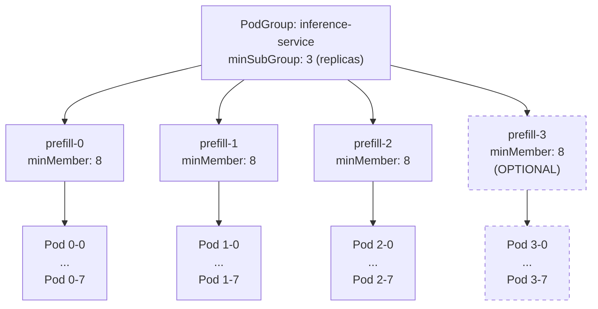
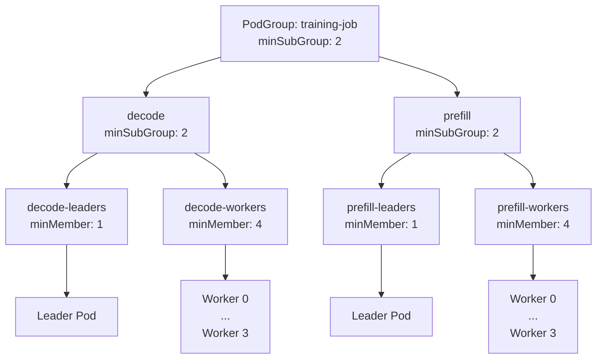

# Hierarchical Elastic workloads with Subgroups via minSubGroups

## Overview

This design document explores improvements to the PodGroup minMember implementation to support **hierarchical elastic gang scheduling**. Currently, minMember only specifies the minimum number of *pods* required across all SubGroups, implicitly requiring all SubGroups to be ready. This design proposes mechanisms to specify the minimum number of *child SubGroups* (or replicas) that must be ready for a PodGroup or SubGroup to be considered schedulable, enabling elastic complex workloads where some replicas may fail while maintaining sufficient capacity.

## Motivation

### Current State

The `minMember` field in PodGroups and SubGroups refers exclusively to the count of descendant pods. This creates an implicit constraint: **all SubGroups must be ready** for the PodGroup to be scheduled. This works well for simple hierarchical structures but limits flexibility for elastic workloads.

**Example Problem (Dynamo/Grove):**
- A Grove workload has 4 prefill replicas (SubGroups), each requiring 8 pods (minMember=8)
- The top-level PodGroup has minMember=32 (4 replicas × 8 pods)
- If *one* prefill replica fails to schedule (e.g., only 6 pods available), the **entire workload fails**
- In practice, 3 prefill replicas might be sufficient to sustain the workload

### Desired State

Enable **per-level minimum replica/SubGroup thresholds** where:
1. Each PodGroup/SubGroup can specify the minimum number of *child SubGroups* required (not just total pods)
2. A PodGroup/SubGroup is ready when the specified minimum number of child SubGroups are themselves ready
3. This enables hierarchical elastic gang scheduling: some replicas can fail while the workload remains viable

## Design Approach

Introduce a new `minSubGroup` field alongside existing `minMember`:
- `minMember`: Minimum number of *descendant pods* required
- `minSubGroup`: Minimum number of *direct child SubGroups* required

### API Changes

```go
type PodGroupSpec struct {
    // MinMember defines the minimal number of descendant pods required
    // Mutually exclusive with MinSubGroup (validation enforced)
    MinMember int32 `json:"minMember,omitempty"`

    // NEW: 
    // MinSubGroup defines the minimal number of direct child SubGroups required
    // Only applicable when SubGroups are defined
    // Mutually exclusive with MinMember (validation enforced)
    // +optional
    MinSubGroup *int32 `json:"minSubGroup,omitempty"`

    SubGroups []SubGroup `json:"subGroups,omitempty"`
    // ...
}

type SubGroup struct {
    Name      string  `json:"name"`

    // MinMember defines the minimal number of descendant pods for this SubGroup
    // Mutually exclusive with MinSubGroup (validation enforced)
    MinMember int32   `json:"minMember,omitempty"`

    // NEW:
    // MinSubGroup defines the minimal number of direct child SubGroups required
    // Only applicable when this SubGroup has child SubGroups
    // Mutually exclusive with MinMember (validation enforced)
    // +optional
    MinSubGroup *int32  `json:"minSubGroup,omitempty"`

    Parent    *string `json:"parent,omitempty"`
    // ...
}
```

### Example: Single-Level Hierarchy (Disaggregated Inference)

```yaml
apiVersion: scheduling.run.ai/v2alpha2
kind: PodGroup
metadata:
  name: inference-service
spec:
  minSubGroup: 3     # Need 3 out of 4 replicas
  subGroups:
    - name: prefill-0
      minMember: 8   # Leaf: uses minMember for pods
    - name: prefill-1
      minMember: 8
    - name: prefill-2
      minMember: 8
    - name: prefill-3
      minMember: 8
```

**Diagram: Single-Level Tree**



### Example: 2-Level Hierarchy (Leader-Worker Groups)

```yaml
apiVersion: scheduling.run.ai/v2alpha2
kind: PodGroup
metadata:
  name: training-job
spec:
  minSubGroup: 2     # Need both decode AND prefill (heterogeneous)
  subGroups:
    - name: decode
      minSubGroup: 2  # Need both leaders and workers
    - name: decode-leaders
      parent: decode
      minMember: 1    # Leaf: uses minMember
    - name: decode-workers
      parent: decode
      minMember: 4

    - name: prefill
      minSubGroup: 2
    - name: prefill-leaders
      parent: prefill
      minMember: 1
    - name: prefill-workers
      parent: prefill
      minMember: 4
```

**Diagram: 2-Level Tree**



**Non-preemptible pods calculation**: (1 + 4) + (1 + 4) = 10 pods

---

## Backward Compatibility

The design is **fully backward compatible** with zero migration required:

1. **`minSubGroup` is optional**: New field defaults to nil
2. **Existing behavior preserved**: When `minSubGroup` is nil, scheduler requires all SubGroups to be ready (current behavior)
3. **No breaking changes**: Existing PodGroups work unchanged

**Scheduler Logic example:**
```go
func GetRequiredSubGroupCount(sg *SubGroup) int {
    if sg.MinSubGroup == nil {
        // All SubGroups required (current behavior)
        return len(sg.Children)
    } else {
        // New behavior: elastic SubGroup selection
        return *sg.MinSubGroup
    }
}
```

**Migration Path:**
- Existing PodGroups continue using `minMember` only
- New PodGroups can adopt `minSubGroup` for elastic gang scheduling
- No forced migration required

---

## Scheduler Logic Changes

The scheduler's pod ordering logic (e.g., `subgrouporder` plugin) must adapt to `minSubGroup` constraints. When a parent has `minSubGroup` set, the scheduler prioritizes SubGroups that are below their `minMember` threshold and contribute toward satisfying the parent's `minSubGroup` requirement. Once the parent's `minSubGroup` is satisfied, additional SubGroups are deprioritized (elastic capacity).

**When `minSubGroup` is nil:** The scheduler falls back to current behavior, requiring **all** child SubGroups to be ready before the parent is considered schedulable.

**Tie-breaking:** When multiple SubGroups are equally starved (e.g., both at 2/3 pods ready), the scheduler defaults to the order defined in the PodGroup spec and queue—scheduling the first pending pod in line.

---

## Validation Rules

The following validations will be enforced via a Validating Webhook:

### Mutual Exclusivity
1. **PodGroup Level**: `minMember` and `minSubGroup` are mutually exclusive
   - If `minSubGroup` is specified, `minMember` must be 0 or unset
   - If `minMember` is specified and > 0, `minSubGroup` must be nil

2. **SubGroup Level**: `minMember` and `minSubGroup` are mutually exclusive for each SubGroup
   - Same rules as PodGroup level

### Field-Specific Validations

**When using `minMember`:**
1. `minMember` must be > 0
2. For mid-level SubGroups/PodGroups: Reserved for future use (currently must use `minSubGroup`)

**When using `minSubGroup`:**
1. `minSubGroup` must be > 0
2. `minSubGroup` must be ≤ number of direct child SubGroups
3. Must have child SubGroups defined (cannot use on leaf SubGroups)

### Structural Validations
1. **Unique SubGroup names** within a PodGroup
2. **Parent references** must exist and not create cycles
3. **Leaf SubGroups** (no children) must use `minMember`, not `minSubGroup`
4. **Mid-level SubGroups** (has children) must use `minSubGroup`, not `minMember`

### Example Validations

** Valid: Leaf SubGroups use minMember**
```yaml
spec:
  minSubGroup: 3     # Need 3 out of 4 replicas
  subGroups:
    - name: prefill-0
      minMember: 8   # Leaf: uses minMember for pods
    - name: prefill-1
      minMember: 8
    - name: prefill-2
      minMember: 8
    - name: prefill-3
      minMember: 8
```

** Valid: Mid-level SubGroups use minSubGroup**
```yaml
spec:
  minSubGroup: 2     # Need both decode + prefill
  subGroups:
    - name: decode
      minSubGroup: 2  # Need both leaders + workers
    - name: decode-leaders
      parent: decode
      minMember: 1    # Leaf: uses minMember
    - name: decode-workers
      parent: decode
      minMember: 4    # Leaf: uses minMember
```

** Invalid: Both minMember and minSubGroup specified**
```yaml
spec:
  minMember: 24      # ERROR: Cannot specify both
  minSubGroup: 3
  subGroups: [...]
```

** Invalid: minSubGroup on leaf SubGroup**
```yaml
spec:
  minSubGroup: 3
  subGroups:
    - name: prefill-0
      minSubGroup: 2   # ERROR: Leaf SubGroup has no children
```

** Invalid: minSubGroup exceeds child count**
```yaml
spec:
  minSubGroup: 5     # ERROR: Only 4 child SubGroups defined
  subGroups:
    - name: prefill-0
    - name: prefill-1
    - name: prefill-2
    - name: prefill-3
```

---

## Design Decision

**Rationale:**
1. **Clarity**: Explicit is better than implicit, especially for complex hierarchical structures
2. **Semi-Preemptible Calculation**: Tree traversal provides accurate non-preemptible pod counts
3. **Future Flexibility**: Keeps both fields available for potential future use cases requiring both constraints
4. **Easier Debugging**: Clear separation makes status reporting and troubleshooting straightforward
5. **Backward Compatibility**: Existing PodGroups continue to work unchanged

---

## Appendix: Alternative Design Considered

### Reusing `minMember` for SubGroup Counting

**Approach:**
Instead of introducing a new `minSubGroup` field, overload the existing `minMember` field to represent minimum SubGroup requirements when the PodGroup/SubGroup has child SubGroups. The semantics would change based on hierarchy level:
- **Leaf SubGroups**: `minMember` represents minimum number of pods
- **Mid-level SubGroups/PodGroups**: `minMember` represents minimum number of child SubGroups

**Example:**
```yaml
apiVersion: scheduling.run.ai/v2alpha2
kind: PodGroup
metadata:
  name: inference-service
spec:
  minMember: 3       # Reused: means "3 child SubGroups" (not pods)
  subGroups:
    - name: prefill-0
      minMember: 8   # Still means "8 pods" (leaf level)
    - name: prefill-1
      minMember: 8
    - name: prefill-2
      minMember: 8
    - name: prefill-3
      minMember: 8
```

**Critical Limitation with Heterogeneous SubGroups:**

This approach fails for the 2-level hierarchy example with heterogeneous SubGroups (decode + prefill). Consider:

```yaml
spec:
  minMember: 2       # Means "any 2 child SubGroups"
  subGroups:
    - name: decode
      minMember: 2   # Means "any 2 child SubGroups"
    - name: decode-leaders
      parent: decode
      minMember: 1   # Means "1 pod"
    - name: decode-workers
      parent: decode
      minMember: 4   # Means "4 pods"
    - name: prefill
      minMember: 2   # Means "any 2 child SubGroups"
    - name: prefill-leaders
      parent: prefill
      minMember: 1
    - name: prefill-workers
      parent: prefill
      minMember: 4
```

The problem: `minMember: 2` at the PodGroup level means "any 2 SubGroups" but the workload requires **specifically** both decode AND prefill (not just any 2). Similarly, `minMember: 2` for decode means "any 2 children" but we need **specifically** both leaders AND workers. There's no way to express "all child SubGroup types must be present" vs "any N child SubGroups" with a single overloaded field.

### Why This Was Rejected

**1. Ambiguous Semantics**
The same field name (`minMember`) would have completely different meanings depending on context:
- At the PodGroup level: "minimum child SubGroups"
- At the SubGroup level: "minimum pods" OR "minimum child SubGroups" (depends on whether it has children)

This context-dependent behavior is confusing for users and error-prone. When reading a PodGroup YAML, it's not immediately clear what `minMember: 3` means without inspecting the SubGroup structure.

**2. Loss of Future Flexibility**
By making `minMember` and `minSubGroup` mutually exclusive but separate fields, we preserve the option for future use cases that might need both constraints simultaneously. For example:
- A mid-level SubGroup requiring "at least 3 child SubGroups AND at least 20 total descendant pods"
- Complex elasticity rules that operate at multiple granularities

Reusing `minMember` would permanently foreclose these possibilities.

**3. Difficult Validation and Error Messages**
With overloaded semantics, validation logic becomes more complex:
- Cannot validate `minMember` value without knowing the SubGroup structure
- Error messages become unclear: "minMember exceeds limit" - limit of what? Pods or SubGroups?
- Harder to provide clear, actionable feedback to users

**4. Status Reporting Confusion**
PodGroup status would need to carefully disambiguate which interpretation of `minMember` applies:
```yaml
status:
  phase: Running
  minMember: 3      # Does this mean 3 pods or 3 SubGroups are ready?
```

**5. Code Maintainability**
Scheduler logic would need constant context-awareness when interpreting `minMember`:
```go
// Confusing: same field, different meanings
if hasChildren(sg) {
    // minMember means SubGroup count
    requiredCount = sg.MinMember
} else {
    // minMember means pod count
    requiredPods = sg.MinMember
}
```

### Chosen Approach Advantages

The selected design with separate `minSubGroup` and `minMember` fields provides:
- **Self-documenting**: Field name clearly indicates what is being counted
- **Type safety**: Different fields prevent accidental misuse
- **Clear validation**: Each field has distinct, unambiguous validation rules
- **Better UX**: Users immediately understand what each field controls
- **Future-proof**: Keeps both dimensions available for advanced use cases

While this approach adds one additional field to the API, the clarity and maintainability benefits significantly outweigh the minor increase in API surface area.

---
