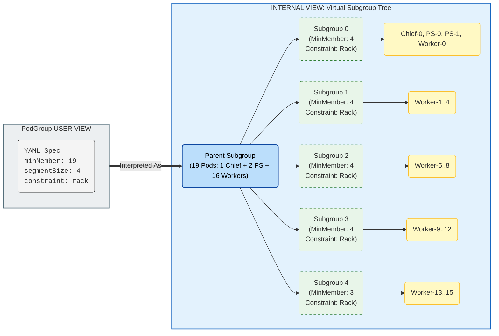

# [WIP] TAS - SubGroup Segment Support

## Motivation

Distributed workloads often use hierarchical communication patterns (e.g., 16 workers in 4 tensor-parallel groups of 4). Communication within groups is frequent and requires tight locality (e.g., NVLink/NVSwitch), while inter-group communication is less frequent.

While SubGroups support hierarchical topology constraints, uniform grouping is currently not supported. We aim to support dividing a subgroup into **Segments**, where each segment has its pods co-located, without the user having to manually define $N$ identical subgroups in the spec.

## Reference Implementations

- Kueue Two-Level Topology: [PR #5449](https://github.com/kubernetes-sigs/kueue/pull/5449), [PR #5353](https://github.com/kubernetes-sigs/kueue/pull/5353), [PR #5596](https://github.com/kubernetes-sigs/kueue/pull/5596)
- SLURM topology/block plugin: [NVIDIA SLUG24 presentation](https://slurm.schedmd.com/SLUG24/NVIDIA-Craig_Tierney.pdf)

## User Stories

### Story 1: Tensor Parallelism Placement

I want my 16 pods distributed training job to be split into 4 groups of 4 pods, where each group is placed on the same rack for fast NVLink/NVSwitch communication.

### Story 2: Multi-Level Constraints

Same as story 1, but the groups should be within the same zone.

### Story 3: Simple Annotation-Based Configuration

I want to specify segment size and topology via annotations on my workload without manually defining subgroups, letting the system automatically create the appropriate structure.

## Assumptions

1. _Distributed workloads frameworks are responsible for ordering their pods_, and advertising their index as a label on the pod. Note that pod index is distinct from distributed training "rank" (see Proposal section for details).
2. Segmentation applies to the entire workload, with all replica types (master, workers, etc.) segmented together using a global index (in the future, we might support per-replica type segmentation).

## Proposal

- We will compute a **global index** for each pod across all replica types in the workload, then assign each pod to its corresponding segment (e.g. when segment size is 4, pods with global indices 0-3 belong to segment-0, pods with global indices 4-7 belong to segment-1).
  > **Note**: Pod index is used for segment assignment at scheduling time, not the distributed training "rank" which may be assigned dynamically at runtime. For frameworks where pod index maps predictably to rank, users can configure segment size accordingly, and infer their segment index from the pod index (e.g. `segment_index = global_index / segment_size`). For frameworks with dynamic rank assignment, segment-based co-location still works, but users should be aware that rank assignment is independent of segment assignment.
- We will represent each segment as a SubGroup with its corresponding Topology Constraints.
- This approach builds upon the existing Hierarchical Topology Constraints mechanism, providing a simplified interface that automatically translates segment specifications into the underlying SubGroup structure.

### API

- Users may define segment requirements via annotations on the **Workload root** (consistent with existing topology constraints):
  - `kai.scheduler/segment-size` - Pod count for each segment
  - `kai.scheduler/segment-topology-required-placement` - Required Topology level
  - `kai.scheduler/segment-topology-preferred-placement` - Preferred Topology level
  - `kai.scheduler/pod-index-label` - (Optional) The label that denotes the pod's global index.

    > **⚠️ Important**: When `pod-index-label` is specified, the user asserts that the label values are **globally unique across all pods in the workload** (no overlapping indices between replica types). If not set, the PodGrouper computes a composite global index automatically based on the workload type (see [Global Index Computation](#global-index-computation)).

- Example TFJob:
  ```yaml
  apiVersion: kubeflow.org/v1
  kind: TFJob
  metadata:
    name: distributed-training
    annotations:
      kai.scheduler/topology: "cluster-topology"
      kai.scheduler/segment-size: "4"
      kai.scheduler/segment-topology-required-placement: "rack"
  spec:
    tfReplicaSpecs:
      Chief:
        replicas: 1
        template:
          spec:
            containers:
              - name: tensorflow
                image: tensorflow/tensorflow:latest
      PS:
        replicas: 2
        template:
          spec:
            containers:
              - name: tensorflow
                image: tensorflow/tensorflow:latest
      Worker:
        replicas: 16
        template:
          spec:
            containers:
              - name: tensorflow
                image: tensorflow/tensorflow:latest
  ```

  This creates segments with composite global indices:
  - **Segment 0**: Chief-0 (idx 0), PS-0 (idx 1), PS-1 (idx 2), Worker-0 (idx 3)
  - **Segment 1**: Worker-1 (idx 4), Worker-2 (idx 5), Worker-3 (idx 6), Worker-4 (idx 7)
  - **Segment 2-4**: Remaining workers in groups of 4

### Global Index Computation

When `pod-index-label` is **not specified**, the PodGrouper computes a composite global index by combining replica type ordering with replica index. This handles workloads where each replica type has its own index space starting at 0 (e.g., TFJob where Chief, PS, and Worker all start at index 0).

The global index is computed as:
$$\text{GlobalIndex} = \sum_{i=0}^{\text{typeIndex}-1} \text{replicas}[i] + \text{replicaIndex}$$

Where `typeIndex` is the position of the pod's replica type in the framework-specific ordering.

When `pod-index-label` **is specified**, the PodGrouper reads the global index directly from that label:
$$\text{GlobalIndex} = \text{pod.labels[pod-index-label]}$$

#### Workload to Index Computation

| **Workload Kind**   | **Replica Type Order** | **Index Label** |
| ------------------- | ---------------------- | --------------- |
| **Job (Indexed)**   | N/A (single type) | `batch.kubernetes.io/job-completion-index` |
| **JobSet**          | N/A (single type) | `batch.kubernetes.io/job-completion-index` |
| **PyTorchJob**      | Master → Worker | `training.kubeflow.org/replica-index` (composite) |
| **TFJob**           | Chief → PS → Evaluator → Worker | `training.kubeflow.org/replica-index` (composite) |
| **MPIJob**          | Launcher → Worker | `training.kubeflow.org/replica-index` (composite) |
| **JAXJob**          | Worker | `training.kubeflow.org/replica-index` |
| **XGBoostJob**      | Master → Worker | `training.kubeflow.org/replica-index` (composite) |
| **LeaderWorkerSet** | N/A (global index) | `leaderworkerset.sigs.k8s.io/worker-index` |

> **Unsupported Workloads**: Workloads not listed in the table above (e.g., RayJobs, custom CRDs) do not have automatic index computation. For these workloads:
> - If `pod-index-label` is specified, it will be used for segmentation (user asserts global uniqueness)
> - If `pod-index-label` is not specified, segment annotations are ignored and the PodGrouper logs a warning

### PodGrouper

When the PodGrouper detects segment annotations on the workload root, it performs the following:

1. **Calculate total pod count**: Sum the replicas across all replica types in the workload.
2. **Calculate number of segments**: 
$$\text{NumSegments} = \lceil \frac{\text{TotalPodCount}}{\text{SegmentSize}} \rceil$$
4. **Create PodGroup with segment SubGroups**: Create a PodGroup for the workload with `NumSegments` child SubGroups. Each SubGroup has:
   - `MinMember` = `SegmentSize` (except the last segment which may have fewer if TotalPodCount is not divisible by SegmentSize)
   - Topology constraints from the segment annotations
5. **Assign pods to SubGroups**: When a pod is created, compute its global index and assign it to the appropriate segment:
   - If `pod-index-label` is specified, read the index directly from that label.
   - Otherwise, compute composite index using replica type ordering and replica index.
   - Assign to segment: 
   $$\text{SegmentID} = \lfloor \frac{\text{GlobalIndex}}{\text{SegmentSize}} \rfloor$$

#### Segment requirements to SubGroup tree mapping



## Future Enhancements

- **Segment Index Injection**: KAI could inject the assigned segment index as an environment variable (e.g., `KAI_SEGMENT_INDEX`) into the pod, similar to SLURM's `SLURM_PROCID`. This would allow the workload process to determine its segment without needing to calculate it.
- **Per-Replica Type Segmentation**: We should support per-replica type segmentation in the future, where each replica type is segmented separately.
