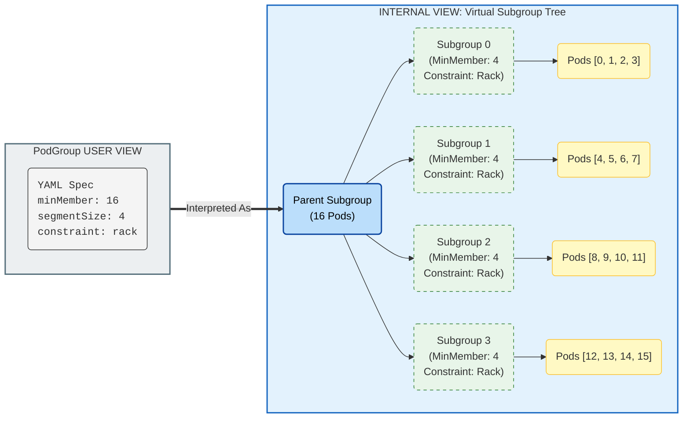

# [WIP] TAS - SubGroup Segment Support

## Motivation

Distributed workloads often use hierarchical communication patterns (e.g., 16 workers in 4 tensor-parallel groups of 4). Communication within groups is frequent and requires tight locality (e.g., NVLink/NVSwitch), while inter-group communication is less frequent.

While SubGroups support hierarchical topology constraints, uniform grouping is currently not supported. We aim to support dividing a subgroup into **Segments**, where each segment has its pods co-located, without the user having to manually define $N$ identical subgroups in the spec.

## Reference Implementations

- Kueue Two-Level Topology: [PR #5449](https://github.com/kubernetes-sigs/kueue/pull/5449), [PR #5353](https://github.com/kubernetes-sigs/kueue/pull/5353), [PR #5596](https://github.com/kubernetes-sigs/kueue/pull/5596)
- SLURM topology/block plugin: [NVIDIA SLUG24 presentation](https://slurm.schedmd.com/SLUG24/NVIDIA-Craig_Tierney.pdf)

## User Stories

### Story 1: Tensor Parallelism Placement

I want my 16 pods distributed training job to be split into 4 groups of 4 pods, where each group is placed on the same rack for fast NVLink/NVSwitch communication.

### Story 2: Multi-Level Constraints

Same as store 1, but the groups should be within the same zone.

### Story 3: Simple Annotation-Based Configuration

I want to specify segment size and topology via annotations on my workload without manually defining subgroups, letting the system automatically create the appropriate structure.

## Assumptions

1. _Distributed workloads frameworks are responsible for ordering their pods_, and advertizing their index(also known as `rank` in PyTorch) as a label on the pod and informing the process of it (in any way they wish).
2. The PodGrouper creates a SubGroup for each PodTemplate within a workload.
3. Segmentation should only be supported for _homogeneous SubGroups_ within a workload.

## Proposal

- We will leverage the pod ordering established by the workload framework to assign each pod to its corresponding segment (e.g. when segment size is 4, pods with indices 0-3 belong to segment-0, pods with indices 4-7 belong to segment-1).
- Users are responsible for providing the segment size to their workload processes, enabling them to calculate their own segment index.
- We will represent each segment as a SubGroup with its corresponding Topology Constraints.
- This approach builds upon the existing Hierarchical Topology Constraints mechanism, providing a simplified interface that automatically translates segment specifications into the underlying SubGroup structure.

### API

- Users may define segment requirements via 4 new fields:
  - SegmentSize - Pod count for each segment
  - SegmentTopology[Required/Preferred]Placement - Required/Preferred Topology level
  - PodIndexLabel - optional; The label that denotes the pod's index. If not set, inferred from the workload type.
- Users may define segment requirements via 4 new annotations on Workload's PodTemplate:
  - `kai.scheduler/segment-size` - Pod count for each segment
  - `kai.scheduler/segment-topology-required-placement` - Required Topology level
  - `kai.scheduler/segment-topology-preferred-placement` - Preferred Topology level
  - `kai.scheduler/pod-index-label` - The label that denotes the pod's index. If not set, inferred from the workload type (see [Workload to Index Label](#workload-to-index-label))
  - Example PyTorchJob:
    ```yaml
    apiVersion: kubeflow.org/v1
    kind: PyTorchJob
    metadata:
      name: distributed-training
    spec:
      pytorchReplicaSpecs:
        Master:
          replicas: 1
          template:
            spec:
              containers:
                ...
        Worker:
          replicas: 16
          template:
            metadata:
              annotations:
                kai.scheduler/segment-size: "4"
                kai.scheduler/segment-topology-required-placement: "rack"
                kai.scheduler/topology: "cluster-topology"
            spec:
              containers:
                - name: pytorch
                  image: pytorch/pytorch:latest
                  command:
                    - python
                    - train.py
    ```

### Validation

- **Divisibility**: `MinMembers` of a SubGroup should be devided by its `SegmentSize` without reminder. This is to ensure that the SubGroup can be satisfied by the segment requirements.

### PodGrouper

- Read the podTemplate annotations from above and create the PodGroup with the appropriate TopologyConstaints on the leaf subgroups.
  - At the moment, the PodGrouper only create SubGroups for Grove workloads. We will need to support appropriate grouping for other workloads as well before we can support segments. The exact grouping logic is out of scope for this design, and is assumed to create a subgroup for each PodTemplate.
- If podIndexLabel is not specified, it will infer it from the workload type based on the following table:

#### Workload to Index Label

| **Workload Kind**   | **Default Index Label**                  |
| ------------------- | ---------------------------------------- |
| **Job (Indexed)**   | batch.kubernetes.io/job-completion-index |
| **JobSet**          | batch.kubernetes.io/job-completion-index |
| **PyTorchJob**      | training.kubeflow.org/replica-index      |
| **TFJob**           | training.kubeflow.org/replica-index      |
| **LeaderWorkerSet** | leaderworkerset.sigs.k8s.io/worker-index |

- Divide the pod count by the segmentSize to determine the number of required segments.
- Create child subgroups with the segment topology constraints. Each subgroup should have `SegmentSize` as its `MinMembers`, up to a total sum of the parent `MinMembers`. Each subgroup added after that will have `MinMembers` of 0.
- Assign the pods to these subgroups based on the following logic: $$\text{SegmentID} = \lfloor \frac{\text{PodIndex}}{\text{SegmentSize}} \rfloor$$

#### Segment requirements to SubGroup tree mapping


