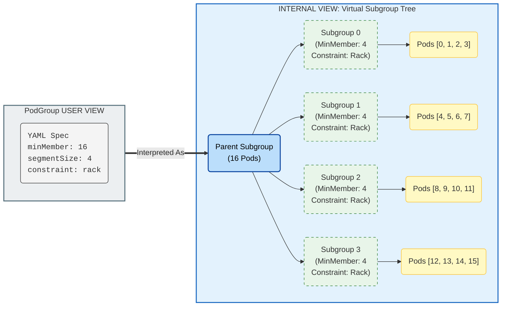

# TAS - SubGroup Segment Support

## Motivation
Distributed workloads often use hierarchical communication patterns (e.g., 16 workers in 4 tensor-parallel groups of 4). Communication within groups is frequent and requires tight locality (e.g., NVLink/NVSwitch), while inter-group communication is less frequent.

While SubGroups support hierarchical topology constraints, uniform grouping is currently not supported. We aim to support dividing a subgroup into **Segments**, where each segment has its pods co-located, without the user having to manually define $N$ identical subgroups in the spec.

## Reference Implementations
- Kueue Two-Level Topology: [PR #5449](https://github.com/kubernetes-sigs/kueue/pull/5449), [PR #5353](https://github.com/kubernetes-sigs/kueue/pull/5353), [PR #5596](https://github.com/kubernetes-sigs/kueue/pull/5596)
- SLURM topology/block plugin: [NVIDIA SLUG24 presentation](https://slurm.schedmd.com/SLUG24/NVIDIA-Craig_Tierney.pdf)

## User Stories
### Story 1: Tensor Parallelism Placement
I want my 16 pods distributed training job to be split into 4 groups of 4 pods, where each group is placed on the same rack for fast NVLink/NVSwitch communication.
### Story 2: Multi-Level Constraints
Same as store 1, but the groups should be within the same zone.
### Story 3: Simple Annotation-Based Configuration
I want to specify segment size and topology via annotations on my workload without manually defining subgroups, letting the system automatically create the appropriate structure.

## Assumptions
1. Distributed workloads frameworks are responsible for ordering their pods, and advertizing their index as a label on the pod and informing the inner container of it (in any way they wish)

## Proposal
### Summary
Leverage the existing Hierarchical Topology Constraints mechanism and provide syntactic sugar to translate segment requirements into SubGroups.

### API
- Users may define segment requirements via 4 new fields:
  - SegmentSize - Pod count for each segment
  - SegmentTopology[Required/Preferred]Placement - Required/Preferred Topology level
  - PodIndexLabel - optional; The label that denotes the pod’s index. If not set, inferred from the workload type.
- The above configuration can be defined on:
  - Annotations on PodTemplate:
    - `kai.scheduler/segment-size`
    - `kai.scheduler/segment-topology-required-placement`
    - `kai.scheduler/segment-topology-preferred-placement`
    - `kai.scheduler/pod-index-label`
  - PodGroup Spec:
    - TopologyConstaints will be added the following:
      - `segmentSize`
      - `segmentRequiredTopologyLevel`
      - `segmentPreferredTopologyLevel`
      - `podIndexLabel`
    - The above will only take effect on leaf subgroups, and emit validation warning/error when described above it (can we forbid it in the API itself?)
    - Example manifest:
    ```yaml
      apiVersion: scheduling.kai.nvidia.com/v2alpha2
      kind: PodGroup
      metadata:
      	name: pg
      spec:
      	minMember: 16
      	topologyConstraint:
      		segmentSize: 4
      		segmentRequiredTopologyLevel: rack
      		podIndexLabel: xx.xx/pod-idx
    ```
### Validation
- **Divisibility**: `MinMembers` of a SubGroup should be devided by its `SegmentSize` without reminder
- **Leaf Constraint**: Segment properties should only be allowed on leaf SubGroup (in case there are no subgroups on the PodGroup, the PodGroup itself is the root and leaf subgroup)
### PodGrouper
- Read the podTemplate annotations from above and create the PodGroup with the appropriate TopologyConstaints on the leaf subgroups.
- If podIndexLabel is not specified, it will infer it from the workload type based on the following table:
**Workload to Index Label**
| **Workload Kind**   | **Default Index Label**                  | **Note**                                   |
|---------------------|------------------------------------------|--------------------------------------------|
| **Job (Indexed)**   | batch.kubernetes.io/job-completion-index | Standard K8s Indexed Job label.            |
| **JobSet**          | batch.kubernetes.io/job-completion-index | JobSet uses standard Job indexing.         |
| **PyTorchJob**      | training.kubeflow.org/replica-index      | Standard Kubeflow training operator label. |
| **TFJob**           | training.kubeflow.org/replica-index      | Standard Kubeflow training operator label. |
| **LeaderWorkerSet** | leaderworkerset.sigs.k8s.io/worker-index | Primary index within the group.            |
### Scheduler
When the scheduler processes a snapshot containing a PodGroup with segment definitions:
1. **Logical Mapping:** It divides the pod count by the segmentSize to determine the number of required segments.
2. **Virtual Subgroups:** It creates in-memory child subgroups, applying the topology constraints to these children.
   Each subgroup should have `SegmentSize` as its `MinMembers`, up to a total sum of the parent `MinMembers`. Each subgroup added after that will have `MinMembers` of 0.
3. **Assignment:** Pods are assigned to these virtual subgroups based on the following logic:
    $$\text{SegmentID} = \lfloor \frac{\text{PodIndex}}{\text{SegmentSize}} \rfloor$$
From there on, the scheduler should behave as it does today with Hierarchal subgroups.
#### Segment Internal Scheduler Representation

### Container segment inference
- The workload framework (JobSetController, PyTorchController, etc.) is responsible for injecting the pod index to the container.
* Containers infer their segment by combining their index with the segment size (index 1 with segment size 4 -> segment-0, index 5 with segment size 4 -> segment-1)

## Open Questions
- Slice/Segment terminology
