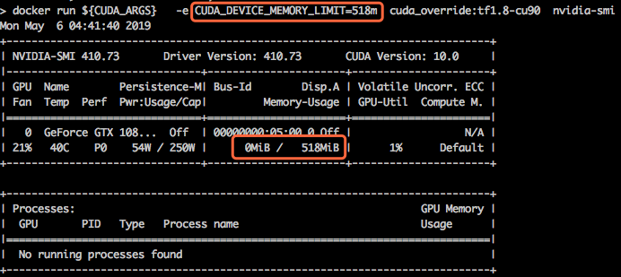
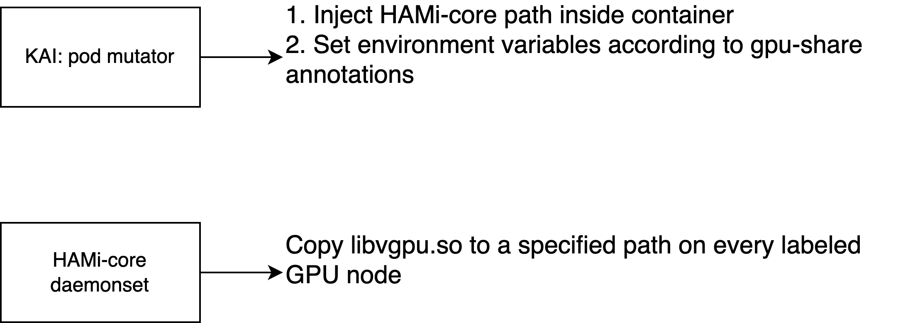

# Resource isolation design

Be Noticed that this document is under evaluation and not been implemented yet.

## Background

Currently, KAI-scheduler does not enforce resource-isolation when using gpu-sharing feature, related issues: [issue#49](https://github.com/NVIDIA/KAI-Scheduler/issues/49), [issue#45](https://github.com/NVIDIA/KAI-Scheduler/issues/45). This document introduces an approach to implement that. 

## Principle

The principle behind this design is by introducing an open source component called [HAMi-core](https://github.com/Project-HAMi/HAMi-core). HAMi-core is the in-container gpu resource controller, it operates by Hijacking the API-call between CUDA-Runtime(libcudart.so) and CUDA-Driver(libcuda.so). The output from building HAMi-core is libvgpu.so. HAMi-core is the key component in a gpu-sharing related CNCF Sandbox project called [HAMi](https://github.com/Project-HAMi/HAMi). The following figure is showing that device memory has beed restricted by HAMi-core.



## Prequisites

Nvidia driver version >= 440

## Architect

The Whole Architect can be shown in the figure below. In order for resource isolation be working properly, we need to do the following actions.
1. Put HAMi-core to a specific path on every GPU-node, it can be done manully or using a daemonset
2. Set corresponding environment variables, and mount HAMi-core inside task container, which can be done by pod-mutator. 



## HAMi-core daemonset installation

You can directly install HAMi-core on your nodes by deploying the DaemonSet with the YAML file provided below.

```yaml
apiVersion: apps/v1
kind: DaemonSet
metadata:
  name: hami-core-distribute
  namespace: default
spec:
  selector:
    matchLabels:
      koord-app: hami-core-distribute
  template:
    metadata:
      labels:
        koord-app: hami-core-distribute
    spec:
      affinity:
        nodeAffinity:
          requiredDuringSchedulingIgnoredDuringExecution:
            nodeSelectorTerms:
            - matchExpressions:
              - key: node-type
                operator: In
                values:
                - "gpu"
      containers:
      - command:
        - /bin/sh
        - -c
        - |
          cp -f /k8s-vgpu/lib/nvidia/libvgpu.so /usr/local/vgpu && sleep 3600000
        image: docker.m.daocloud.io/projecthami/hamicore:latest
        imagePullPolicy: Always
        name: name
        resources:
          limits:
            cpu: 200m
            memory: 256Mi
          requests:
            cpu: "0"
            memory: "0"
        volumeMounts:
        - mountPath: /usr/local/vgpu
          name: vgpu-hook
        - mountPath: /tmp/vgpulock
          name: vgpu-lock
      tolerations:
      - operator: Exists
      volumes:
      - hostPath:
          path: /usr/local/vgpu
          type: DirectoryOrCreate
        name: vgpu-hook
     # https://github.com/Project-HAMi/HAMi/issues/696
      - hostPath:
          path: /tmp/vgpulock
          type: DirectoryOrCreate
        name: vgpu-lock
```

## Q&A

Q: Will it effect pods using GPU exclusively?

A: No.

Q: What happens when enabling gpu-sharing, but not prepared HAMi-core on corresponding GPU node?

A: Same as what it is now, the task won't fail or crash, simply doesn't have resource isolation inside container.