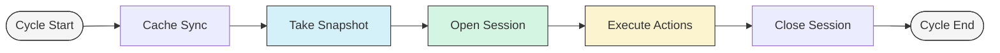

# Scheduler Core Concepts

## Overview

KAI Scheduler uses a sophisticated architecture built around several key concepts that work together to provide efficient, fair, and consistent scheduling decisions. Understanding these concepts is essential for developers working with the scheduler, whether developing plugins, debugging issues, or contributing to the core scheduler.

The scheduler operates on a **cycle-based model** where each cycle takes a consistent snapshot of the cluster state, makes scheduling decisions through a series of actions, with each action committing/rolling back individual job operations.

## The Scheduling Cycle

The scheduler runs in periodic cycles (configurable via `schedulePeriod`). Each cycle follows this flow:

1. **Cache Sync**: Ensure all Kubernetes resource informers are up-to-date
2. **Snapshot**: Capture point-in-time cluster state
3. **Session**: Create scheduling context with snapshot data
4. **Actions**: Execute scheduling actions in sequence (Allocate → Consolidate → Reclaim → Preempt → StaleGangEviction)
   - Each action processes jobs individually, creating and committing/discarding statements per job
5. **Session Close**: Clean up and prepare for next cycle

## Cache

The **Cache** serves as the authoritative source of cluster state, built from Kubernetes API informers.

### Cache Responsibilities

- **Data Collection**: Aggregate information from multiple API resources
- **State Maintenance**: Keep track of resource changes over time
- **Snapshot Generation**: Create consistent point-in-time views
- **Change Propagation**: Apply committed scheduling decisions back to cluster

## Snapshots

**Snapshots** are the foundation of KAI Scheduler's consistency model. A snapshot is a point-in-time capture of the entire cluster state at the beginning of each scheduling cycle.

Snapshots capture all the cluster resources and state information needed for scheduling decisions, including pods, nodes, queues, pod groups, bind requests, and other relevant Kubernetes objects.

For detailed information about snapshots and the snapshot plugin, see [Snapshot Plugin](../plugins/snapshot.md).

### Why Snapshots Matter

1. **Consistency**: All scheduling decisions in a cycle are based on the same cluster state
2. **Performance**: Avoids repeated API calls during scheduling
3. **Debugging**: Provides reproducible state for analysis

## PodGroups

**PodGroups** represent gang scheduling units where multiple pods must be scheduled together as a single atomic operation. They ensure that either all pods in a group are scheduled or none are scheduled.

PodGroups are automatically created by the pod-grouper component based on workload types and can specify minimum member requirements, queue assignments, and priority classes.

For detailed information about PodGroup creation and gang scheduling, see [Pod Grouper](pod-grouper.md).

## Sessions

A **Session** represents the scheduling context for a single cycle. It contains the snapshot data, plugin callbacks, and provides the framework for scheduling operations.

<!-- GuyTodo: Validate this -->
### Session Responsibilities

- **State Management**: Maintains consistent view of cluster during cycle
- **Plugin Coordination**: Provides extension points for plugin callbacks
- **Statement Factory**: Creates Statement objects for actions to use
- **Resource Accounting**: Tracks resource allocations and usage

## Actions Framework

**Actions** are discrete scheduling operations executed in sequence during each cycle. Each action operates on the session's snapshot data and uses statements to ensure atomicity.

For detailed information about action types, execution order, and implementation details, see [Action Framework](action-framework.md).

## Statements and Transaction Model

**Statements** provide a transaction-like mechanism for scheduling operations, allowing changes to be grouped and either committed or rolled back as a unit. Actions use statements to ensure atomicity when making scheduling decisions.

For detailed statement operations and usage patterns, see [Action Framework - Statements](action-framework.md#3-statement).

## Scenarios

**Scenarios** represent hypothetical scheduling states used to evaluate potential decisions before committing them. They enable "what-if" modeling and validation of scheduling operations.

For detailed scenario implementation and validation mechanisms, see [Action Framework - Scenarios](action-framework.md#1-scenarios).

## Plugins

The scheduler uses a plugin-based architecture that allows extending functionality through various extension points. Plugins register callbacks during session lifecycle to influence scheduling behavior.

For detailed information about plugin development, extension points, and examples, see [Plugin Framework](plugin-framework.md).

## BindRequests

**BindRequests** facilitate communication between the scheduler and binder components. When the scheduler decides where a pod should run, it creates a BindRequest containing the pod, selected node, and resource allocation details.

The binder processes BindRequests asynchronously, handling the actual pod binding and any required resource setup such as volume mounting or dynamic resource allocation.

For detailed information about the binding process and BindRequest lifecycle, see [Binder](binder.md).

## Related Documentation

- [Action Framework](action-framework.md) - Detailed action implementation
- [Plugin Framework](plugin-framework.md) - Plugin development guide
- [Binder](binder.md) - Pod binding process
- [Pod Grouper](pod-grouper.md) - Gang scheduling implementation
- [Snapshot Plugin](../plugins/snapshot.md) - Snapshot capture and analysis tools
