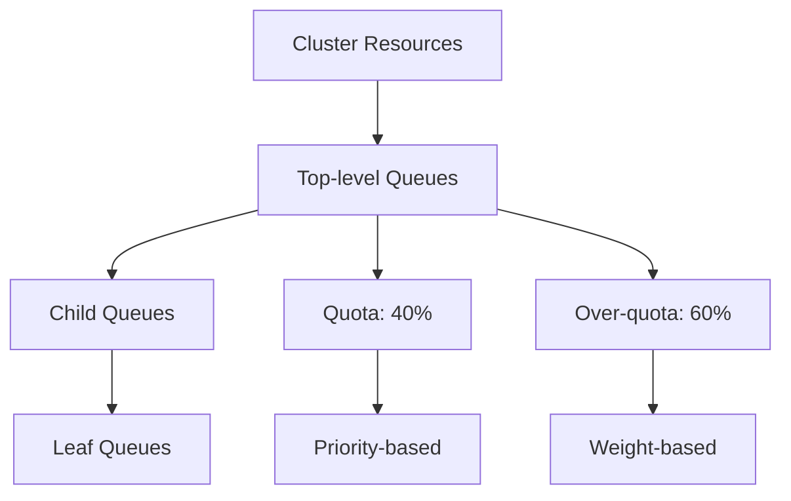

# Fairness

KAI Scheduler implements hierarchical fair-share scheduling using multi-level queues to distribute cluster resources equitably across users and projects.

> **Prerequisites**: Familiarity with [Scheduling Queues](../queues/README.md) concepts

## Table of Contents
- [Resource Allocation](#resource-allocation)
- [Fair Share Calculation](#fair-share-calculation)
- [Reclaim Strategies](#reclaim-strategies)
- [Configuration](#configuration)

## Resource Allocation

Resources are allocated hierarchically across queue levels:

1. **Quota allocation**: Guaranteed resources distributed first
2. **Over-quota distribution**: Remaining resources allocated by priority and weight
3. **Hierarchical propagation**: Process repeated at each queue level



## Fair Share Calculation

Fair share determines queue scheduling priority and reclaim eligibility:

- **Scheduling Priority**: Queues below fair share are prioritized
- **Saturation Ratio**: `Allocated / FairShare` used for reclaim decisions
- **Reclaim Eligibility**: Queues can only reclaim if their saturation ratio remains lowest among siblings

## Reclaim Strategies

### Strategy 1: Fair Share Reclaim
Queues below fair share can evict workloads from queues above fair share.

### Strategy 2: Quota Reclaim  
Queues under quota can evict workloads from queues over quota.

> **Priority**: Strategy 1 is preferred over Strategy 2

## Configuration

### Reclaim Sensitivity
Adjust reclaim aggressiveness using `reclaimerUtilizationMultiplier`:

```yaml
pluginArguments:
  proportion:
    reclaimerUtilizationMultiplier: "1.2"  # 20% more conservative
```

| Value | Behavior |
|-------|----------|
| `1.0` | Standard comparison (default) |
| `> 1.0` | More conservative reclaim |
| `< 1.0` | Not allowed (prevents infinite cycles) |
